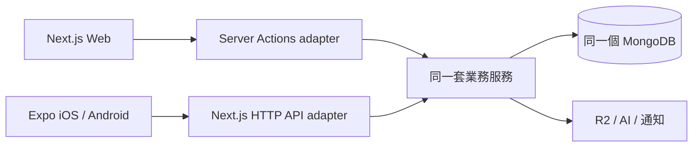
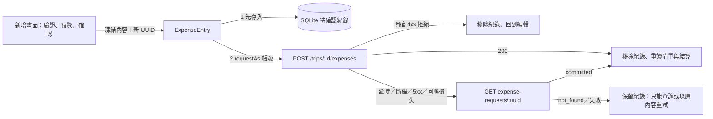

# 手機 App 架構

採 Expo + React Native + Expo Router + TypeScript strict，位於 `travel-budget/apps/mobile`。同一 repository 的 `apps/web` 維護 Web、API 與業務服務；`packages/contracts` 提供共用 HTTP DTO 與 runtime schema。

## 一套後端，兩種前端

登入憑證檢查、旅行列表與摘要、支出清單／明細、結算讀取與新增支出的寫入服務（`createExpenseForActor`，Server Action 與 HTTP 各為 adapter）都已接入此分工；手機的新增畫面透過同一組 HTTP API 寫入，金額分攤由後端預覽，手機只送出預覽的結果。



Server Actions 與 HTTP API 是兩個呼叫入口，部署初期同在現有 Next.js。權限、分帳、交易、冪等與檔案驗證只維護一套服務。此專案不建立 API server、MongoDB connection 或 migrations。

## B3：Mobile 帳本與舊資料恢復

線上旅行／帳務讀取與新確認操作使用 v2，HTTP 必須驗證共用 v2 schema 的 ledger；缺單位、子資料單位不一致或服務未就緒都阻擋，不 fallback v1。`api.baseUrl` 仍是原已驗證 v1 環境識別；transport 從同 origin 派生 v2，共用登入世代、refresh、beforeSend 與 SQLite／429 scope。遠端 Query key 尾端加 v2，本機 key 不變。名冊觀察器與 catalog 保留原撤權世代規則。

`api/contracts.ts` 只組合共用 schema：選用的 optional ledger 型別允許讀舊本機 TWD 快照；live v2 一律要求 ledger。`api/ledger.ts` 的缺欄位 TWD 退路只供上述已知 v1／舊快照與尚未載入的畫面。所有閱讀、原幣判斷、均分預覽／編輯、還款及匯率設定使用實際基準；JPY 也保留兩位精度，結算與尾差仍由後端決定。每日參考值走旅行 v2 endpoint，並核對回傳基準。

SQLite schema 9 以同一交易在 C／E envelope 加 api_version、base_currency、money_scale；舊列外標 v1／TWD／2，不改 frozen JSON、UUID、順序、denied 或 429。新草稿 raw JSON 保存 ledger／apiVersion，catalog 保存帶 ledger 的選項；舊 raw JSON 不重寫，只能按 TWD 續填，續填與目前選項單位不同時保留並阻擋確認。新 C／E 保存 v2 body 與來源單位；加入前未知基準的 E envelope 以 null 保留未知，查回原 receipt 才取得單位，不預設為 TWD，恢復查原 endpoint、原 UUID，不能跟隨新設定重建 body。C 新版重試先查 receipt，錯誤或不同單位不清紀錄；已損壞的 pending 解析阻擋，不再略過讓新 UUID 可送。

D queued／prepared 延續 v1 的 TWD／匯率 1／均分；非 TWD 帳本與外幣只能保存草稿，入列／prepare／同步各自檢查。非 TWD 建立依後端 capabilities 顯示選擇，後端開關目前仍關閉。iPhone＋iPad 操作由他人驗收，Android 僅保留工程相容；B4 未完成，完整裝置與閱讀器不在此結案。

## 目錄與依賴

```text
src/
  app/                 Expo Router 路由；匿名帳號頁與 (app) 的線上分頁／私有動作／受限本機頁
  features/
    auth/              登入、恢復登入與安全路由；匿名註冊／Email 驗證碼重設
    navigation/        全域／旅行分頁、我的、選旅行與本機記帳入口
    trips/             旅行列表、摘要與查詢 hooks
    expenses/          支出清單、明細、游標查詢與列資料轉換；新增支出：輸入驗證、草稿與預覽狀態、
                       送出與不確定結果恢復引擎、待確認畫面
    localDrafts/       受限本機入口、最小旅行快照與持久化撤權
    settlement/        結算畫面、查詢與本人視角排序
  providers/           Query、SafeArea、Auth 及網路／前景同步
  api/                 HTTP client、runtime DTO 驗證、session manager
  storage/             環境隔離的 SecureStore 憑證／本機身分；草稿、旅行快照與待確認支出的 SQLite 紀錄
  components/          共用按鈕、頁面、提示與指標
  i18n/                四語訊息與裝置語系 adapter
  theme/               深淺語意色彩、字級／行高、間距、圓角與尺寸 tokens
docs/                  現況、規範、契約與規劃
  decisions/           架構決策紀錄
assets/                目前保留 Expo 模板圖示
```

路由為 `trips/[id]`（摘要）、`trips/[id]/expenses`（清單）、`trips/[id]/expenses/new`（新增）、`trips/[id]/expenses/[expenseId]`（明細）與 `trips/[id]/settlement`；`features/expenses`、`settlement` 各放畫面、查詢選項與可單元測試的純函式。

`AppProviders` 留在根 `_layout`，登入、QueryClient、草稿、C／D 與 E 引擎不因切分頁／表單而重建。`(app)` 的 Stack 同時容納 `(tabs)`、私有 `trips` 動作、`record` 選擇器及 `(local)`；`Stack.Protected` 只在 signedIn 時提供前三者，local 只進本機頁。全域及旅行分頁使用既有 Expo Router Tabs；同層透過 navigator 的 navigate 切換，選取當前頁不堆疊。選擇器以 replace 交給既有新增／本機草稿，取消可 pop 回原分頁；成功進旅行使用 dismissTo 沿用原分頁。網址維持原路徑，新增 `/me`、`/record` 與 `/work`。

`components/frame.tsx` 按容器分配安全區域：全域列負責底部、旅行頁首負責頂部，FlatList 直接使用 ScreenFrame，不外包 ScrollView。`components/screen.tsx` 管理共用頁首與 FormPage 的鍵盤避讓，表單在分頁外仍沿用 feature 的 usePreventRemove 與 D 保存；命名旅行上下文與整個旅行空間受既有 catalog／HTTP 撤權限制，長名稱留在可捲動內容中。

支出清單使用 TanStack Query 的游標式無限查詢；下拉更新一起重讀名冊，支出只保留並重讀最新一頁，較舊頁面按需再載入。所有私人查詢的 key 以 `[API 環境, 帳號, 資源, 旅行…]` 開頭，換帳號不會讀到同一筆快取，登出仍會清除全部。 成員標籤在畫面上層建索引，閱讀頁共用 expense-options 的帳號／環境／旅行 key，observer 設定 refetchOnMount false，列與標籤不掛載查詢；TripChrome／表單仍重新核對選項。建立／編輯／還款 context 與最新衝突 context 各建索引，規則及歷史名冊限制見 [FEATURES 成員識別](FEATURES.md#成員識別)。

依賴方向：`app → features → api / storage / i18n / theme`。API 與 storage 不得反向 import 畫面或路由；route 不直接呼叫 fetch，也不計算業務交易。跨 feature 使用明確的公開 export，避免引用彼此內部元件。

共用 UI 使用 `theme/tokens.ts` 與 `components/ui.tsx`；`components/icons.tsx` 以原生 View 輪廓／ActivityIndicator 實作裝飾圖示，不新增字型或平台依賴。Action 的明確 `variant` 優先於舊 `secondary`；Notice 的 `tone` 決定視覺語意，`announce` 決定通知強度，可用 `announceText` 提供簡短摘要。一般說明預設不通知，warning／danger 預設 polite；自動保存與秒數倒數明確停用通知。iOS 按訊息／強度變更通知 VoiceOver，Android／Web 使用 live region；Card 不合併子控制項的朗讀焦點。TextField 的 ref、事件與鍵盤 props 由呼叫端提供，元件管理聚焦／錯誤輪廓，頁面仍負責業務驗證與完成入口。

`api` 負責 transport、headers、timeout、錯誤映射；feature hooks 負責 query key 與快取失效。表單輸入由 `DraftEditor` 管理並持久化，遠端狀態交給 Query；沒有跨頁需求時不增加全域狀態框架。

## 資料能力與後續工作

| 類型         | 目標責任                                              | 實作時機           |
| ------------ | ----------------------------------------------------- | ------------------ |
| 遠端快取     | TanStack Query；key 包含帳號、環境與資源範圍          | 已實作（僅記憶體） |
| 登入憑證     | access token 記憶體；refresh token SecureStore        | 已實作             |
| 待確認支出   | SQLite 紀錄（`expo-sqlite`），獨立於可清除的快取      | 已實作（階段 C）   |
| 支出草稿     | 原始表單、修訂保存與原子交接；不保存預覽              | 已實作（D1）       |
| 離線草稿入口 | 最小旅行／成員選項快照、受限本機身分、冷啟動續填      | 已實作（D2）       |
| 待送支出     | 均分意圖、多筆佇列與前景同步；OS 背景排程另排         | 已實作（D3）       |
| 原生生命週期 | AppState／網路 adapter 接 Query focus／online manager | 已實作             |
| 檔案         | App 私有目錄、穩定 upload ID、begin／finish 協議      | 相簿與附件階段     |
| 通知         | 原生裝置 token 與後端裝置註冊                         | 核心流程穩定後     |

Query 預設不重試；私人資源的讀取經 `keepAccessDenial`：收到存取拒絕（401／403／404）後，該拒絕保持為查詢的錯誤，暫時性失敗不會讓隱藏的快取重新出現，直到成功讀取。其他請求發現的拒絕（例如新增支出的預覽被拒）以 `recordAccessDenial` 記為該資源查詢的錯誤，效果相同。HTTP 在 401 時由 session manager 合併 refresh、最多重送一次。429 尊重 Retry-After；其餘錯誤由使用者明確重試。登入／登出先取消並清除私人查詢，key 包含 API 環境與帳號。Token 不進 Query cache；refresh 持久化完成後才公開登入狀態。`SessionManager.requestAs(userId, …)` 只在該帳號仍是目前登入者時送出，換帳號或登出後在送出前就失敗，不會用另一個帳號的 token 送出前一個帳號的請求。

前景／網路 adapter 在啟動時同步目前 AppState，回到前景時重新讀取連線狀態；較舊的非同步網路讀取不得覆蓋較新的事件或讀取結果。Query 沿用 30 秒新鮮期，回前景／重新連線會更新已過期的觀察中查詢，離線暫停的首次讀取可在連線恢復後繼續。

憑證輪替後若安全儲存失敗，session manager 清除舊 session 與私人快取，並嘗試撤銷新憑證。非同步恢復、refresh、登出及儲存清除都檢查登入世代，避免舊請求覆蓋後續登入；請求的回應不論是資料或錯誤（包括看似確定的 400、404、5xx 與斷線），登入世代已更換就一律以 `CANCELLED` 結束，不會被當成新登入的答覆。同一世代的 refresh／登出各自合併併發請求。

## 新增支出與不確定結果

線上新增是一個與畫面無關的引擎（`features/expenses/entry.ts` 的 `ExpenseEntry`），由 `ExpenseEntryProvider` 在 App 層建立一次；畫面只呼叫它並顯示結果，離開畫面不會取消或清除已送出的請求。



- **先存後送**：紀錄含環境（API 位址）、帳號、旅行、UUID、凍結的請求內容與狀態（`sending`／`unconfirmed`），不含 token。寫入失敗就不送出 HTTP。表以 `(environment, account_id, client_request_id)` 為主鍵，所有讀寫都帶環境與帳號，不同帳號或環境互不可見。App 重啟後仍在，登出、換帳號與清除查詢快取都不會刪除它。
- **只有明確的伺服器答覆才結案**：200（含重播）或查詢得到 `committed` 才移除紀錄並顯示已儲存；寫入前的明確拒絕（來自 API 本身的 400／413／415 等）才移除並回到編輯。401／403／404／429 與所有逾時、斷線、5xx、無法解析的回應都不證明沒寫入（先前的嘗試可能已提交），紀錄保留。非 API 本身的 4xx（例如閘道的網頁）同樣不被信任。refresh 的 HTTP／傳輸錯誤另標記來源，只暫停並保留紀錄，不套用支出端點的拒絕規則；晚到錯誤先檢查登入世代。409 一律查明原請求，不換 UUID。
- **不確定期間鎖定**：只能查詢結果，或以同一個 UUID 與同一份內容重試（後端以 receipt 去重，不會重複記帳）；同一旅行在紀錄確認前不能新增其他支出，避免把可能已存的支出重新輸入。同一個請求的查詢與重試依序執行。
- **恢復**：App 啟動、回前景與恢復連線時，對目前帳號的所有紀錄查詢結果（只讀，不自動重送）；本機移除失敗時不再送出，下次讀取再移除。
- **帳號隔離**：引擎的每個請求經 `requestAs`；晚到的舊帳號回應（成功或錯誤皆然，包括 400）一律以 `CANCELLED` 結束，只讓該帳號的紀錄維持待確認，不影響新帳號，也不刪除紀錄；同帳號再次登入後以查詢找回。

Web 預覽沒有登入也沒有資料庫，打包時改用 `pendingExpenseDatabase.web.ts`，不引入 `expo-sqlite` 的 wasm 版本。SQLite 邏輯寫在小型介面之後（`storage/pendingExpenses.ts`），測試以 Node 內建 SQLite 執行同一份 SQL。

## 草稿保存與交接（D1）

`DraftEditor` 管理原始輸入、保存狀態與續填／捨棄。保存工作不依賴畫面掛載；同一環境／帳號／旅行的所有 editor 共用序列，重新進入會先等前一畫面的存檔。`expense_draft` 主鍵為 `(environment, account_id, trip_id)`，每筆含草稿 UUID、修訂號、原始輸入、更新時間與狀態。只更新同一草稿世代的較新修訂；捨棄／成功留下不含輸入的 tombstone，晚到存檔不能復活草稿。序列與 UI 修訂檢查避免舊存檔回應把最新狀態標成已保存。保存失敗保留記憶體輸入並提供重試。

資料庫仍為 `travel-budget-pending.db`；`storage/expenseDatabase.ts` 集中管理交易與版本升級，新增草稿表但保留原 C pending 表。共用連線的全部讀寫序列執行，C 的前景查詢不會混進 D1 的交易。草稿確認時 `PendingExpenseStore.insert(record, draftRef)` 在單一交易核對草稿 UUID／修訂、建立 pending 的凍結內容，再標記來源為 `handed-off`。交易失敗不送出；提交後原草稿保持鎖定，即使當機或清理失敗也不能用新 UUID 重送。明確拒絕時 `remove(..., 'rejected')` 同時恢復原始輸入並移除 pending；成功時同時清空草稿輸入與移除 pending。結果不明仍由 C 的原請求負責。

新增入口按環境／帳號／旅行重新掛載，避免前一帳號的 UI 狀態殘留。每次進入先重新以 `requestAs` 讀取旅行選項，成功後才顯示本機草稿；已知撤權持續隱藏，直到成功讀取。續填只還原原始輸入，任何修改取消舊預覽。預覽前再刷新成員／分類，失效選項需明確修正，取得新的後端分攤並經使用者確認才交給 C。已授權的開啟表單離線時仍可存檔；斷線取消舊預覽，恢復連線後須重取。受限離線入口見 D2。

## 受限離線入口（D2）

`SessionManager` 的 `local` 狀態只有本機帳號身分，沒有 session／access token。SecureStore 將 refresh token 與線上確認過的 user 原子保存在同一環境 slot；token 外層格式與 user 分開驗證；本機 user 不符合目前 schema 時忽略身分，保留有效 token 供線上刷新，不能因此進入本機模式。舊格式 token 仍可線上更新，但不能推測本機帳號。只有 restore 的 NETWORK／TIMEOUT 可降入本機模式，401 清除身分，安全儲存失敗與其他伺服器錯誤仍顯示登入錯誤。`(app)` 的線上分頁與私有動作只接受 signedIn；`(local)` 的 `/drafts` 與 `/drafts/[id]` 接受 signedIn／local。本機表單共用 D1 editor，禁止離線 HTTP 預覽／提交；可按 D3 契約明確確認均分規則並加入待送佇列。`requestAs` 仍須有效 session，未確認草稿不因網路恢復自動送出。同步與 C 的自動結果查詢只在 signedIn／前景／連線時執行。

資料庫版本 3 新增 `draft_trip`，保留 D1／C 表與原始輸入。只保存旅行名稱、成員／分類選項、更新時間與拒絕標記，不保存帳務數字或整份 Query cache。`DraftCatalog` 觀察 Query 的實際成功讀取並以共用 SQLite 序列保存；手動寫入 Query cache 不算授權。旅行摘要預載成員選項，只有名稱的快照可顯示入口但不能建立草稿。快照保存失敗不阻擋既有線上帳務，提供本機保存失敗提示。

旅行層級的 403／404（單筆支出不存在除外）及預覽拒絕同步阻擋本機顯示，再保存清空名稱／選項的 tombstone。拒絕持久化失敗仍保持本次執行隱藏，讀列表前重試；只有拒絕標記成功落盤才承諾跨重啟保護。只有在最近一次撤權後開始的成員選項請求成功讀取與保存，才解除拒絕。`DraftCatalog` 在 Query fetch 開始時記錄環境／帳號／旅行的撤權世代；開始時間未被觀察或跨越後續撤權的成功回應不寫入快照，較舊的成功保存也不能清除之後的拒絕。原始草稿不被刪除，權限恢復後可重新確認。所有本機查詢使用帳號／環境 key、networkMode always，換帳號重新掛載 editor，Query 清除不刪除草稿／快照／pending。

## 確認後的待送佇列（D3）

`features/expenseQueue/sync.ts` 的 `ExpenseQueue` 共用 App 層引擎與生命週期；登入路由及本機路由皆可進 `/queue`。`storage/expenseQueue.ts` 保存每筆均分意圖，資料庫版本 4 新增 `expense_queue`；版本 5 加入列內 `rate_limit_until`，版本 6 新增按帳號／環境保存的 `expense_rate_limit` 並遷移各範圍最大期限，保留 C／D1／D2 與既有佇列資料。所有表共用序列／交易；查詢快取清除不影響佇列。確認草稿與原世代 tombstone 在同一交易，避免同一草稿重複加入，下一次開啟可建立新草稿。未送出項目移回草稿時產生新的草稿世代；舊 editor 保存不得覆蓋。準備送出與 C pending 原子交接，C 結案也原子清理佇列／pending。原始輸入及成員 ID 順序只存本機，不含 token／成員姓名／整份預覽；凍結後的 HTTP body 保存在 pending。

同步先重讀選項並比對整份 ID 順序，再取後端預覽；跨撤權世代的回應不能交接，非同步交接完成後再檢查撤權，並將同一世代與前景／連線檢查經 C 傳到 HTTP transport，每次 fetch 前同步執行，涵蓋 C 序列等待、SQLite 讀取／狀態保存及 refresh 後重送；撤權後保留 UUID／凍結內容並停止新的 POST。準備後只能查回／同 UUID 重試；失去授權保留原紀錄，refresh 錯誤不當成支出拒絕。C 在 POST／查詢收到 429 時立即持久化 `next_at`，涵蓋手動操作、自動恢復及 POST 失敗後的查詢；後續較短等待不覆蓋已存期限。429 在同一交易保存列內等待與獨立帳號／環境期限；佇列同步及 C 新增、手動查詢／重試、自動恢復皆讀取共用期限，捨棄、移回草稿或 receipt 結案不會解除等待，非佇列 C 的 429 也會保存。共用 SQLite 連線在讀取期限與限速交易提交後更新帳號／環境的記憶體期限；C 在每次 fetch 前同步檢查最新期限，涵蓋 SQLite 等待後的 POST、receipt 查詢與 refresh 重送，避免非同步讀取後新增的限速被略過。交易回滾不發布期限，本機攔截攜帶原始毫秒截止時間，C 與 D 都保存原值，不套用新 429 的至少 30 秒等待，也不因秒數進位而延長期限。每輪同步先檢查限速，再決定是否跳過衝突旅行；`reason = conflict` 不會將限速降成旅行內等待。版本 4 的衝突紀錄無法區分舊等待來源，升級保守將既有 `next_at` 同時保留為限速期限，到期後仍可只跳過該旅行。409 在查詢原 receipt 前先落盤，後續撤權、登入或限速錯誤不清除衝突；C 查詢／手動重試也遵守冷卻；App 前景以 30 秒 tick、回前景及網路恢復繼續，每個帳號環境只執行一個佇列 run，同一 pending 的 lookup／retry 仍由 C 序列。409 尚查不到 receipt，以及同旅行 C 未結案導致交接受阻，皆保存至少 30 秒等待，只跳過該旅行並繼續其他旅行；重啟後同樣遵守等待，409 保留原 UUID／凍結內容且不自動 POST。其他暫時性故障及其冷卻仍停止本輪。未入佇列的草稿從不自動提交，非佇列 C 紀錄只查詢。完整狀態、確認／分攤與失敗語意見 [D3 契約](BACKEND_CONTRACT.md#d3-離線確認與分攤契約)。尚無 OS 背景工作。

## 共用與平台界線

手機與後端以 `workspace:*` 引用 `@travel-budget/contracts`，schema 單一來源為 `packages/contracts/src/index.ts`，OpenAPI 為 `packages/contracts/openapi.json`。`src/api/contracts.ts` 是薄 adapter，重新匯出共用 DTO 並保留憑證非空的用戶端驗證，不另維護 DTO 定義。從 repository 根目錄執行 `pnpm contracts:generate` 更新產物，`pnpm contracts:check` 檢查同步。

共用契約只依賴純 TypeScript／Zod，不含 Node.js、React、Next.js、MongoDB 或 server SDK。Mobile 不引用 `apps/web` 原始碼。純金額／分攤規則、幣別與翻譯內容仍是後續共用候選，須先隔離平台依賴；目前使用後端既有計算結果。

React Native 畫面不能直接沿用 Radix、DOM、Leaflet 或 Next provider。照片選取、推播、SecureStore 與 SQLite 採平台 adapter；公開分享頁與 Web PWA 繼續留在網站。Web 預覽只是開發便利入口。

pnpm workspace 統一安裝與 lockfile；App 各自保留 React／Expo 相容組合、產品版本與發布流程。根目錄 package 是 private coordinator，沒有產品版本。整併與邊界見 [repository 決策](../../../docs/decisions/0001-monorepo.md)。Expo 自動偵測 workspace 並設定 Metro，無須額外的 monorepo resolver 設定。

官方依據：[Expo Router 安裝與入口](https://docs.expo.dev/router/installation/)、[Expo monorepo 支援](https://docs.expo.dev/guides/monorepos/)、[TanStack Query React Native 整合](https://tanstack.com/query/latest/docs/framework/react/react-native)。

## 旅行入口（E1）

`features/tripEntry` 的線上表單、操作恢復引擎與邀請頁接獨立 E HTTP；`storage/mutations.ts` 在同一 DB schema 7 新增 `pending_mutation`，按環境／帳號／UUID 保存確認內容，交易升級保留 C／D。未確認表單只留畫面記憶體，導航以未儲存提醒保護；已確認者不可改／捨棄，只有終局 receipt 結案；成功清除 payload，E3／E4 拒絕保留輸入供新確認。啟動／前景／連線事件只查，不自動 POST。`expense_rate_limit` 仍是 C／D／E 共用帳號期限，同步鏡像守住最後一次 fetch；額外登入世代守住 SQLite 等待後 A→B→A。E1 無 tripId 時按操作種類防重，E3／E4 以同一 SQLite 序列／原子 pending 檢查協調 C／D／E 同旅行的確認與交接。

邀請頁用當次畫面狀態，沒有 Query 或 SQLite 快取；帳號／登入世代、請求世代與撤權 token 核對後才顯示或複製／分享。加入回應不保存 D 快照，導向後的 landing／expense-options 才重新授權。後端 `tripEntry.ts` 是 Web／HTTP 共用旅行交易服務，receipt 與站內副作用同交易，外部寄送於提交後處理。

## E2 匿名帳號入口

`(account)` 只允許 signedOut 進入；`AccountScreen` 使用 `AccountFlow` 管理註冊／寄碼／驗碼狀態，透過同一 `ApiClient` 發匿名請求，不經 SessionManager 的憑證或 refresh。共用輸入 schema 驗證正規化與 UTF-8 bytes，確認密碼只留 UI；離開／登入切換取消回應並清空輸入，晚到結果不能導向新流程。成功只以帳號／成功提示導回登入頁。

密碼、碼與未確認表單沒有 SQLite／Query／preferences 持久化；不走 E1 操作表或 C／D 佇列，不自動重試。收到 429 保留當次畫面的絕對等待期限並倒數，ApiClient 同時限制匿名端點；後端 keyed-hash 限流為權威，重開不能繞過。

## E3 支出維護

`expenses/maintenance.ts` 處理白名單差異、context／preview／再核對版本；`EditExpenseScreen` 的表單只存當次畫面，明確確認交給既有 `TripEntry` 引擎，與 D editor 分開。`pending_mutation` schema 8 增加 trip_id，C insert／D prepare／E insert 在同 DB 交易互查鎖；原請求恢復仍可執行。scope 的登入世代與每旅行撤權 token 在非同步等待前捕捉、每次 fetch 前核對，共用帳號期限不隨結案或提示移除消失。

E3 成功只存最小 receipt 結果並刷新資源，刪除明細不再重讀；終局拒絕保留本人非敏感輸入供明確重開，重開先授權及讀最新 context，可切回基本資料再人工確認。衝突核對採前一 context 為基線，只保留實際修改的欄位，其餘更新為最新內容，取消舊預覽並要求重新確認。結果不明不能換 body／UUID／捨棄，生命週期只查。四語、語意色彩、safe area、鍵盤與無障礙標籤沿用共用 UI；裝置驗收另行交接。

## E4 還款

`settlement/paymentForm.ts` 只驗證輸入並核對後端建議，不複製結算算法；`PaymentScreen` 共用登記／撤銷的線上表單，明確核對最新 context 後才交 `TripEntry` 保存。`payment.create`／`payment.delete` 沿用 schema 8 E 操作表、帳號／環境期限、C／D／E 同旅行互斥與登入／撤權守衛，無額外 schema 升級或原生依賴。

已確認請求凍結，啟動／前景／重連只查 receipt；終局拒絕保留原輸入，重開先讀授權 context，新確認才有新 UUID。查詢快照不保存還款 context，撤權立即隱藏私人資料。成功刷新既有結算／landing／列表，只讀失敗不推翻寫入；方向／金額不依 receipt 歷史快照樂觀覆蓋目前資料。後端服務與完整錯誤規則見 [E4 契約](BACKEND_CONTRACT.md#e4-登記與撤銷還款)。

## U2a 顯示層

`i18n/format.ts` 提供純金額／匯率／date-only 顯示，`useDisplayFormat` 依 App 四語傳入 locale；旅行卡片／概覽與支出閱讀共用，原始表單值與後端 money 規則不變。`expenses/ExpenseRow` 與 `rows.expenseMemberLabel` 只整理目前可見 DTO，使用 ID 識別本人及同名，null 參照與可選虛擬旗標明示狀態，沒有額外成員查詢或帳務快取。後端旗標只加入授權讀取的白名單，不改 Web／public DTO 或既有 receipt。

## G1a 旅行管理

`features/trips/TripSettingsScreen.tsx` 由私有 settings 路由依環境／帳號／旅行重新掛載；`settingsForm.ts` 只準備實際修改欄位及衝突重新套用。HTTP／contracts 與 Web 共用 `tripManagement.ts`；管理員資料及個人封存分開 revision，日期沿用相片重綁。確認後擴充既有 TripEntry／mutationPayload 的 trip.update／trip.archive，不另建引擎或 DB；pending 的同旅行鎖延續 C／D／E。`managementRefresh.ts` 在提交成功後只讀刷新相關 Query 與 D 名稱／選項快照，擷取登入／catalog 世代並同步檢查 429 期限；失敗不改已提交結果，429 落盤。地點只傳白名單真實座標，首片不增加地理搜尋依賴。

## G1b 成員管理

`TripMembersScreen` 由環境／帳號／旅行／恢復來源重新掛載，線上讀全名冊、核對 revision 後確認建立／更名；未確認輸入不落盤。沿用 TripEntry／mutationPayload 的 member.create／member.rename 與 schema 8 操作表，pending 互斥、固定 UUID、429 及撤權世代不另造機制。管理員拒絕不當作失去成員資格，原結果仍可查；對象不再虛擬需取消更名。成功只讀刷新沿用 managementRefresh，取消舊 options 請求後發布授權新名冊至共用 label Query 與 D 快照，避免晚到舊資料覆蓋現名／旗標。結算歷史旗標由後端原參照提供，public 結算仍使用原白名單；契約見 [G1b](BACKEND_CONTRACT.md#g1b-成員與虛擬成員)。

## G1c 存取管理

`TripAccessScreen` 掛在名冊管理入口，依環境／帳號／旅行重新掛載，讀 context／重新選擇／明確確認，再交同一 TripEntry 的 trip.access 操作。角色與移除只讀刷新；成功退出／刪除先隱藏記憶體入口，等待已排入 catalog 的舊快照保存完成後，SQLite `complete` 與 draft_trip denied 同交易提交，再取消旅行讀取並刷新列表。原結果恢復只對 leave／delete 意圖放行帳號範圍的 receipt，從不放行隱藏旅行的寫入；成功後操作列表不再導航至舊旅行，其他撤權資料仍隱藏。即使丟回應、退出後重啟或本機結案失敗，都保留原 UUID。認領入口只讀授權 URL，由使用者複製／系統分享到既有 Web 認領流程。契約及限制見 [G1c](BACKEND_CONTRACT.md#g1c-權限與危險操作)。

## G2a 幣別設定

`TripCurrencyScreen` 的 route 按環境／帳號／旅行／恢復來源隔離。畫面一次讀最新設定，用回傳的 supportedCurrencies 搜尋與建立欄位，不在每列掛查詢。未確認輸入不落盤；參考匯率明確讀取，與設定內容分開，失敗保留輸入且不產生假匯率。`currencyForm` 保留完整數值與可 round-trip 的科學記號，不用 parseFloat 部分解析或格式化四捨五入。

確認後新增 `trip.currency` payload，仍使用 schema 8 的 pending_mutation／同旅行協調／共用帳號 429，無新資料表；Web／HTTP 回傳原 revision result，E 引擎處理原 UUID 查詢與重送。拒絕保存原 settings 供 scoped 畫面重讀後恢復，403 admin loss 先查 receipt，不清除有效成員快取。成功用既有 refreshManagedTrip 更新授權快取；不改草稿、C pending 或 D 佇列內容。契約見 [G2a](BACKEND_CONTRACT.md#g2a-旅行幣別與參考匯率)。

## G2b 原幣新增與固定匯率

expense-options 在同一次旅行讀取補常用／預設設定與後端支援清單。新增使用完整原幣額與匯率預覽，後端仍 computeSplits→roundMoney→既有 createExpenseForActor／receipt，不新增手機換算演算法或改供應商。草稿保存可選 currency／rateText／rateSource／rateDate；缺欄位的既有 JSON 維持 TWD／1，schema 8 無 DDL／重寫。confirmedFields 驗回應原幣／精確匯率、成員與 TWD 分攤加總，再原子交接 C；sameExpense 比對固定原額／幣別／匯率與每份分。

表單的參考／預覽讀取共用 SQLite 帳號限速與登入／catalog 世代；確認 guard 經 ExpenseEntry.submit 傳入原內容 retry，每次 transport（含 refresh 重送）重新核對。429 保存失敗保持本表單期限並提示，後續先重試落盤；重啟保護仍以成功保存為前提。D 入列與 prepare／同步另檢查 TWD／1，外幣草稿不會被解讀成 TWD 意圖。讀取設定或参考值不改已存在原始輸入或 frozen body。

## G2c 外幣編輯

E3 edit-context 在同一授權交易帶回旅程幣別選項與可選 recalculate 能力；equal 保持舊 App 的 TWD 範圍。後端將已存各人 TWD 份額與原額／歷史匯率的 computeSplits 比對，合法且相同才允許重算；基本更新仍只 $set 明確 metadata。PATCH 新形狀成對帶 currency／exchange_rate，省略兩欄仍為舊 TWD／1 body；凍結操作及 receipt 指紋不補預設或遷移。

maintenance 純函式以歷史原額／幣別／String(rate) 初始化，讀 context → 原幣預覽 → 再讀 context；版本變動回衝突，不接受新 revision 自動寫入。畫面以輸入世代阻擋改值／斷線後晚到的預覽。衝突核對保留明確編輯，rate／currency 成對保留；E 引擎按原 UUID 及內容持久化／恢復，沿用資料庫 schema 8。編輯讀取共用 expenseReadGuard：429 保存失敗先重試落盤，普通預覽檢查 catalog 可見性，明確載入 context 可重新授權，但仍核對登入與撤權世代。
