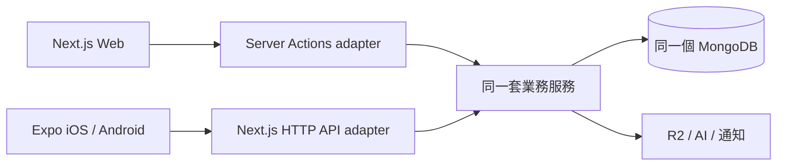
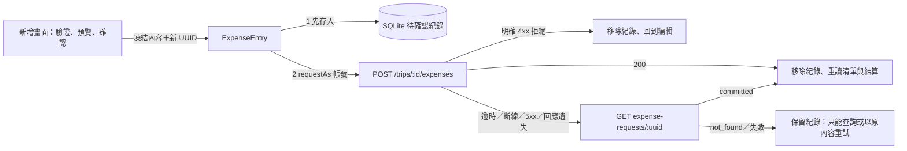

# 手機 App 架構

採 Expo + React Native + Expo Router + TypeScript strict，位於 `travel-budget/apps/mobile`。同一 repository 的 `apps/web` 維護 Web、API 與業務服務；`packages/contracts` 提供共用 HTTP DTO 與 runtime schema。

## 一套後端，兩種前端

登入憑證檢查、旅行列表與摘要、支出清單／明細、結算讀取與新增支出的寫入服務（`createExpenseForActor`，Server Action 與 HTTP 各為 adapter）都已接入此分工；手機的新增畫面透過同一組 HTTP API 寫入，金額分攤由後端預覽，手機只送出預覽的結果。



Server Actions 與 HTTP API 是兩個呼叫入口，部署初期同在現有 Next.js。權限、分帳、交易、冪等與檔案驗證只維護一套服務。此專案不建立 API server、MongoDB connection 或 migrations。

## 目錄與依賴

```text
src/
  app/                 Expo Router 路由；只組裝畫面與導航
  features/
    auth/              登入、恢復登入與安全路由
    trips/             旅行列表、摘要與查詢 hooks
    expenses/          支出清單、明細、游標查詢與列資料轉換；新增支出：輸入驗證、草稿與預覽狀態、
                       送出與不確定結果恢復引擎、待確認畫面
    settlement/        結算畫面、查詢與本人視角排序
  providers/           Query、SafeArea、Auth 及網路／前景同步
  api/                 HTTP client、runtime DTO 驗證、session manager
  storage/             環境隔離的 SecureStore refresh token adapter；待確認支出的 SQLite 紀錄
  components/          共用按鈕、頁面、提示與指標
  i18n/                四語訊息與裝置語系 adapter
  theme/               語意色彩與間距 tokens
docs/                  現況、規範、契約與規劃
  decisions/           架構決策紀錄
assets/                目前保留 Expo 模板圖示
```

路由為 `trips/[id]`（摘要）、`trips/[id]/expenses`（清單）、`trips/[id]/expenses/new`（新增）、`trips/[id]/expenses/[expenseId]`（明細）與 `trips/[id]/settlement`；`features/expenses`、`settlement` 各放畫面、查詢選項與可單元測試的純函式。

支出清單使用 TanStack Query 的游標式無限查詢；下拉更新只保留並重讀最新一頁，較舊頁面按需再載入。所有私人查詢的 key 以 `[API 環境, 帳號, 資源, 旅行…]` 開頭，換帳號不會讀到同一筆快取，登出仍會清除全部。

依賴方向：`app → features → api / storage / i18n / theme`。API 與 storage 不得反向 import 畫面或路由；route 不直接呼叫 fetch，也不計算業務交易。跨 feature 使用明確的公開 export，避免引用彼此內部元件。

`api` 負責 transport、headers、timeout、錯誤映射；feature hooks 負責 query key 與快取失效。表單狀態留在畫面，遠端狀態交給 Query；沒有跨頁需求時不增加全域狀態框架。

## 資料能力與後續工作

| 類型         | 目標責任                                              | 實作時機           |
| ------------ | ----------------------------------------------------- | ------------------ |
| 遠端快取     | TanStack Query；key 包含帳號、環境與資源範圍          | 已實作（僅記憶體） |
| 登入憑證     | access token 記憶體；refresh token SecureStore        | 已實作             |
| 待確認支出   | SQLite 紀錄（`expo-sqlite`），獨立於可清除的快取      | 已實作（階段 C）   |
| 待送支出     | 完整離線 outbox：離線建立、批次重送、背景同步         | 階段 4             |
| 原生生命週期 | AppState／網路 adapter 接 Query focus／online manager | 已實作             |
| 檔案         | App 私有目錄、穩定 upload ID、begin／finish 協議      | 相簿與附件階段     |
| 通知         | 原生裝置 token 與後端裝置註冊                         | 核心流程穩定後     |

Query 預設不重試；私人資源的讀取經 `keepAccessDenial`：收到存取拒絕（401／403／404）後，該拒絕保持為查詢的錯誤，暫時性失敗不會讓隱藏的快取重新出現，直到成功讀取。其他請求發現的拒絕（例如新增支出的預覽被拒）以 `recordAccessDenial` 記為該資源查詢的錯誤，效果相同。HTTP 在 401 時由 session manager 合併 refresh、最多重送一次。429 尊重 Retry-After；其餘錯誤由使用者明確重試。登入／登出先取消並清除私人查詢，key 包含 API 環境與帳號。Token 不進 Query cache；refresh 持久化完成後才公開登入狀態。`SessionManager.requestAs(userId, …)` 只在該帳號仍是目前登入者時送出，換帳號或登出後在送出前就失敗，不會用另一個帳號的 token 送出前一個帳號的請求。

前景／網路 adapter 在啟動時同步目前 AppState，回到前景時重新讀取連線狀態；較舊的非同步網路讀取不得覆蓋較新的事件或讀取結果。Query 沿用 30 秒新鮮期，回前景／重新連線會更新已過期的觀察中查詢，離線暫停的首次讀取可在連線恢復後繼續。

憑證輪替後若安全儲存失敗，session manager 清除舊 session 與私人快取，並嘗試撤銷新憑證。非同步恢復、refresh、登出及儲存清除都檢查登入世代，避免舊請求覆蓋後續登入；請求的回應不論是資料或錯誤（包括看似確定的 400、404、5xx 與斷線），登入世代已更換就一律以 `CANCELLED` 結束，不會被當成新登入的答覆。同一世代的 refresh／登出各自合併併發請求。

## 新增支出與不確定結果

線上新增是一個與畫面無關的引擎（`features/expenses/entry.ts` 的 `ExpenseEntry`），由 `ExpenseEntryProvider` 在 App 層建立一次；畫面只呼叫它並顯示結果，離開畫面不會取消或清除已送出的請求。



- **先存後送**：紀錄含環境（API 位址）、帳號、旅行、UUID、凍結的請求內容與狀態（`sending`／`unconfirmed`），不含 token。寫入失敗就不送出 HTTP。表以 `(environment, account_id, client_request_id)` 為主鍵，所有讀寫都帶環境與帳號，不同帳號或環境互不可見。App 重啟後仍在，登出、換帳號與清除查詢快取都不會刪除它。
- **只有明確的伺服器答覆才結案**：200（含重播）或查詢得到 `committed` 才移除紀錄並顯示已儲存；寫入前的明確拒絕（來自 API 本身的 400／413／415 等）才移除並回到編輯。401／403／404／429 與所有逾時、斷線、5xx、無法解析的回應都不證明沒寫入（先前的嘗試可能已提交），紀錄保留。非 API 本身的 4xx（例如閘道的網頁）同樣不被信任。refresh 的 HTTP／傳輸錯誤另標記來源，只暫停並保留紀錄，不套用支出端點的拒絕規則；晚到錯誤先檢查登入世代。409 一律查明原請求，不換 UUID。
- **不確定期間鎖定**：只能查詢結果，或以同一個 UUID 與同一份內容重試（後端以 receipt 去重，不會重複記帳）；同一旅行在紀錄確認前不能新增其他支出，避免把可能已存的支出重新輸入。同一個請求的查詢與重試依序執行。
- **恢復**：App 啟動、回前景與恢復連線時，對目前帳號的所有紀錄查詢結果（只讀，不自動重送）；本機移除失敗時不再送出，下次讀取再移除。
- **帳號隔離**：引擎的每個請求經 `requestAs`；晚到的舊帳號回應（成功或錯誤皆然，包括 400）一律以 `CANCELLED` 結束，只讓該帳號的紀錄維持待確認，不影響新帳號，也不刪除紀錄；同帳號再次登入後以查詢找回。

Web 預覽沒有登入也沒有資料庫，打包時改用 `pendingExpenseDatabase.web.ts`，不引入 `expo-sqlite` 的 wasm 版本。SQLite 邏輯寫在小型介面之後（`storage/pendingExpenses.ts`），測試以 Node 內建 SQLite 執行同一份 SQL。

## 共用與平台界線

手機與後端以 `workspace:*` 引用 `@travel-budget/contracts`，schema 單一來源為 `packages/contracts/src/index.ts`，OpenAPI 為 `packages/contracts/openapi.json`。`src/api/contracts.ts` 是薄 adapter，重新匯出共用 DTO 並保留憑證非空的用戶端驗證，不另維護 DTO 定義。從 repository 根目錄執行 `pnpm contracts:generate` 更新產物，`pnpm contracts:check` 檢查同步。

共用契約只依賴純 TypeScript／Zod，不含 Node.js、React、Next.js、MongoDB 或 server SDK。Mobile 不引用 `apps/web` 原始碼。純金額／分攤規則、幣別與翻譯內容仍是後續共用候選，須先隔離平台依賴；目前使用後端既有計算結果。

React Native 畫面不能直接沿用 Radix、DOM、Leaflet 或 Next provider。照片選取、推播、SecureStore 與 SQLite 採平台 adapter；公開分享頁與 Web PWA 繼續留在網站。Web 預覽只是開發便利入口。

pnpm workspace 統一安裝與 lockfile；App 各自保留 React／Expo 相容組合、產品版本與發布流程。根目錄 package 是 private coordinator，沒有產品版本。整併與邊界見 [repository 決策](../../../docs/decisions/0001-monorepo.md)。Expo 自動偵測 workspace 並設定 Metro，無須額外的 monorepo resolver 設定。

官方依據：[Expo Router 安裝與入口](https://docs.expo.dev/router/installation/)、[Expo monorepo 支援](https://docs.expo.dev/guides/monorepos/)、[TanStack Query React Native 整合](https://tanstack.com/query/latest/docs/framework/react/react-native)。
