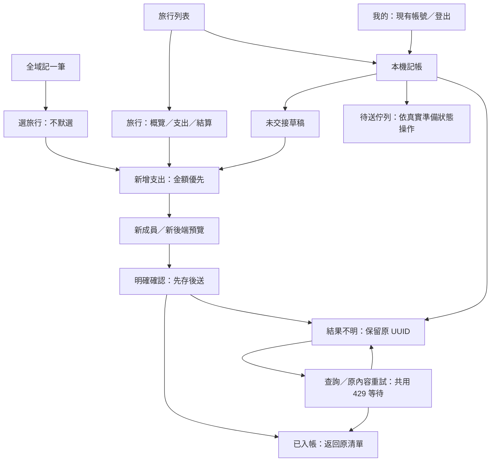

# 開發路線

只保留下一步與完成條件；現況見 [FEATURES](FEATURES.md)，契約見 [BACKEND_CONTRACT](BACKEND_CONTRACT.md)，操作與待驗清單見 [LOCAL_ACCEPTANCE](LOCAL_ACCEPTANCE.md)，已完成成果見 [archive](archive/README.md)。

## 目前位置（2026-10-08）

C 線上記帳、D 草稿／離線均分佇列與 E1–E4 基本使用流程已交付。依最新驗收紀錄，E 的 iOS／Android Expo Go 操作與故障矩陣已完成；完整閱讀器、development build、真機與外部郵件投遞仍待驗。E 驗收狀態沿用既有紀錄；本輪另執行下方 U0a 畫面盤點。

**2026-10-08 優先順序調整：先 G 補齊日常旅行記帳功能，再 F 原生交付與集中裝置驗收。** U1／U2a–e 已提交首輪實作，主要完成既有頁面對齊，並未補齊 Web 的產品能力。依使用者指示，現階段暫緩裝置與完整流程審查；必要的型別、契約、受影響帳務／權限回歸仍隨開發執行。歷史待驗項目保留，未驗不計通過。已修正 [U review 清單](LOCAL_ACCEPTANCE.md#u-靜態審查修正交接2026-10-08)，G1a–c 已實作並分片提交；本輪範圍核對及重點回歸通過，完整獨立驗收仍未完成。G2a 幣別設定與匯率已實作，G2b 外幣新增與草稿已實作，G2c 外幣編輯已實作；本次程式審查的 3 項 P2 與 1 項 P3 已修正並通過獨立複驗，見 [G2 修正清單](LOCAL_ACCEPTANCE.md#g2-獨立程式審查2026-10-08)；裝置與完整流程仍待驗。

**目前為 B4 跨端核對，接續 B5 版本整併／v1 退役**：B1–B3 已實作，三項程式審查修正已獨立複驗；操作驗收仍見 LOCAL_ACCEPTANCE。B5a／b 可先做盤點與共用入口整理，停用舊契約須滿足 B5 退役條件；非 TWD 建立預設關閉，G3／G4／F 延後。

## U：Web／Mobile 使用體驗一致性

目標：使用者在 Web 與 App 間切換，能沿用同一套功能名稱、資訊判讀與操作習慣。以**現有 Web 手機版**為主要對照、桌面版為資訊架構參考；保留原生返回、鍵盤、安全區域、文字縮放與離線恢復。2026-10-07 已補 iOS 代表畫面及同資料／英文 Web 對照。依使用者決定，**iOS 是首輪設計、開發與交付基準，Android 補拍與裝置工作延後交給其他人**；保留 Android 相容性，不把未驗算成通過。U0b／U0c 已交付首輪 iOS 導覽、資訊順序、對照原型與視覺規格，U1a–U1c 共用元件、導覽／容器及旅行列表／概覽已實作，U2a 支出閱讀／格式、U2b 新增／編輯／結果及 U2c 結算／還款顯示、U2d 帳號／旅行表單及 U2e 本機／恢復狀態已完成實作；U 首輪程式交付完成，待獨立 iOS 驗收，後續工程順序見 F；原生缺口與獨立驗收仍依下方範圍交接。

**順序：U0 → U1a → U1b → U1c → U2a～U2e，逐片實作與獨立驗收。** F1 原生工程可同步推進，F2 帳號恢復不必等視覺工作；F3 新頁沿用 U 元件。U1／U2 在 F4 試用包前完成，F5 驗收改版後畫面。U0 沒定案的導覽或欄位決策，不由各頁實作者自行發明。

### U0：盤點、對照與設計定案

**交付是可實作的設計規格與對照稿，本階段不更改產品行為。** 首輪核對實際 Web／iOS，再以本節記錄決策；Android 對照延後；舊 UX archive 只供追溯，不作現行畫面的替代證據。

#### U0a：建立相同資料的對照基線

- 固定 Web／Mobile commit、API 環境、fixture、語系、字級、外觀及 viewport／裝置。使用本機隔離後端與測試帳號，先確認實際 bundle／HTTP 目的地；不以正式資料截圖。Web 手機寬度至少取窄版與一般版，App 各取一台 iOS／Android；Web 桌面只用來核對功能階層。
- 共用案例：無旅行、新旅行、多人有帳務、同名／長名稱／虛擬成員、待收／待付／餘額零、外幣／非均分既有資料，以及草稿／待送／結果不明。每個畫面記「入口 → 首屏資訊 → 主動作 → 完成後位置」和 loading／empty／error／offline／denied；未適用標明原因。
- 對照列固定為「頁面／Web 現況／App 現況／目標／保留差異及理由／資料是否足夠／交付片段／驗收證據」。截圖使用同一案例編號、四語不混比；畫面與證據放既有驗收產物位置，本節只記結論與連結，不另開每頁報告。

**本輪狀態：iOS 代表頁已盤點，完整 U0／獨立驗收尚未完成。** 保存 26 張 iOS、5 張相同資料／英文 Web 對照，加上既有 35 張 Web／匿名 Mobile 預覽，共 66 張畫面。原始截圖、AX／DOM、固定案例與 scope 位於私有 [畫面索引](/tmp/tb-u0a-20261007/index.html)；`manifest.json`／`screens.json` 記環境、來源與尺寸。索引以 CSS 裁切顯示 iOS 裝置內容，原始完整 Device Hub 截圖仍可開啟。沒有修改產品程式、確認帳務、寄信或更新密碼；只保存本輪本機草稿及取得預覽。

- **環境**：初始 Web／匿名預覽取 `49a7a1d7792bce04a7bfe169e76162a9db05e475`；續作 iOS 與英文 Web 取 `57e9dff4f15d512fb449f05631bbbcda3b08d665`，中間只有已提交的 Expo patch 相依更新，畫面來源未改。沿用隔離 `tb_mobile_6efdc9d04bc44f1f9679fe95bb7f28f2` replica set、專用 `u0a-*` 帳號及相同旅行 ID；後端已在相同 `http://127.0.0.1:49587` 恢復，外部服務停用。原生 Metro `8095` 的 iOS bundle 已確認只含此環境 `/api/v1`。
- **配置**：初始 Web 繁中／淺色取 320×740、390×844，另有深色與桌面階層；續作英文 Web 390×844 對照 iOS 27.0 `TravelBudget E Acceptance`。這版 Xcode 改由 **Device Hub** 提供可控制的原生視窗，不再因找不到 Simulator.app 判定 iOS 不可操作。App 實際顯示英文；系統語言曾切繁中但 App 仍英文，不宣稱繁中通過。淺色、預設 Text Size 3，草稿另取工具上限 11 的代表畫面；語言／字級已恢復原配置。圖片尺寸不是原生邏輯 viewport，也不是完整字級驗收。
- **範圍**：Android 未拍，依使用者指示延後；不是 iOS 規格與下一步設計的阻擋條件。Native 代表畫面不替代故障、真機、閱讀器或完整四語驗收；未用舊 E 截圖或 Mobile Web 會員停用頁冒充此次原生證據。

| 案例             | 固定資料                                                                                                                                                              | 畫面證據／剩餘缺口                                                                                                                                                                                                                             |
| ---------------- | --------------------------------------------------------------------------------------------------------------------------------------------------------------------- | ---------------------------------------------------------------------------------------------------------------------------------------------------------------------------------------------------------------------------------------------- |
| C00 匿名         | 登入、註冊、寄碼、已有碼；測試 Email，不輸入碼／新密碼或寄信。                                                                                                        | iOS 英文實際表單與鍵盤；Web／預覽英文對照。成功回頁、四語與投遞另驗。                                                                                                                                                                          |
| C01 多人帳務     | 3 人含同名、長名虛擬成員；100.01 TWD 非均分 10／80.01／10，3,000 JPY×0.0333＝99.9、各 33.3；已還款 20.5。全團 199.91，本人分攤 43.3／應收 36.21，另一成員應付 92.81。 | iOS 列表、概覽、支出、外幣明細／基本編輯、新增、結算、手動還款與邀請；5 張英文 Web 同資料對照。邀請系統分享、應付帳號、提交完成與故障待補。既有 `transport` 分類不在手機字典，顯示 Other，編輯保留原值；不能當作正常 transportation 分類樣本。 |
| C02 新旅行       | 2 人、無支出／還款，日期 2026-10-07～09。                                                                                                                             | iOS 支出空頁、無帳務結算、建立／加入初始表單。未確認建立／加入。                                                                                                                                                                               |
| C03 餘額零       | 100 TWD、各 50，已還款 50。                                                                                                                                           | iOS／Web 已結清與已登記還款；自然零餘額／無還款仍待補。                                                                                                                                                                                        |
| C04 無旅行／拒絕 | 專用無旅行帳號未加入 C01。                                                                                                                                            | 既有 Web 空列表／拒絕；iOS 尚未補，不當作已驗。                                                                                                                                                                                                |
| C05 本機工作     | 專用本機草稿：說明 `TEST U0a local visual draft`、12.34 TWD；只預覽 4.12／4.11／4.11。                                                                                | iOS 保存提示、鍵盤、預覽、草稿列表、恢復提示／續填、空佇列／空待確認、大字級代表頁。續填後要求重新線上預覽；非空佇列、已凍結結果不明、限速／讀取失敗、離線及冷啟動待補。                                                                       |

下表的 App 現況以**本輪 iOS 實際畫面**為主；沒觀察到的狀態仍明列待補。完整畫面索引見上述連結。

| 頁面             | Web 現況                                     | iOS 現況                                                                                   | 首輪設計目標                                                             | 保留差異及理由                                        | 資料能力                                             | 交付／證據                                             |
| ---------------- | -------------------------------------------- | ------------------------------------------------------------------------------------------ | ------------------------------------------------------------------------ | ----------------------------------------------------- | ---------------------------------------------------- | ------------------------------------------------------ |
| 全域／旅行內導覽 | 固定五項全域列、旅行四分頁與次分頁。         | 返回為頁內大 Action；概覽四個功能 Action，沒有全域列。                                     | 三個全域位置；旅行內概覽／支出／結算穩定切換。                           | 不放 App 未支援的地圖／相簿／行程假分頁。             | route 足夠；保留 provider 生命週期。                 | U1b；C01 trip、expenses、settlement。                  |
| 旅行列表         | 狀態、名稱、日期、人數／本人分攤，長名省略。 | 建立／加入／待確認／登出／草稿／佇列在卡片前，首屏被操作區占用。                           | 建立／加入縮為一列，本機固定入口；帳號操作移到我的。                     | 保留 FlatList／分頁／下拉刷新與本機模式。             | mySpent／myBalance／memberCount 足夠；不逐卡查預算。 | U1b／c；C01 trips，C04 iOS 待補。                      |
| 概覽             | 主頁是行程，帳務摘要在上。                   | 長標題／說明及四個大按鈕後才是日期；帳務指標不在首屏。                                     | 精簡頁首；本人分攤／應收付在日期與說明前。                               | 概覽不改名行程；今日團費不是本人花費。                | landing 足夠；實際預算未設顯示 Not set，不猜零。     | U1c；C01 trip。                                        |
| 支出／明細       | 日期分組、列內展開；繁中日期混英文。         | ISO 日期、TWD／JPY 碼，另進明細；同名份額只顯示姓名。                                      | 本幣／原幣分層；本人標記與同名 ID 後綴一致。                             | 保留游標及原幣唯讀；無附件 API 不放按鈕。             | 既有 DTO 足夠；搜尋／附件另排。                      | U2a；C01 expenses、fx-detail、C02 empty-expenses。     |
| 新增／編輯       | 金額優先、全頁表單、底部主動作。             | 長說明／保存提示→描述→金額；分攤及預覽要下捲；外幣編輯只能改基本資料。                     | 金額優先、說明分層、保存狀態短列；確認區仍顯示完整分攤。                 | 保留新預覽、草稿、明確確認及外幣／非均分保護。        | context／preview 足夠；成功／衝突／不明待補。        | U2b；C01 new-expense、edit-fx、C05 preview／keyboard。 |
| 結算／還款       | 本人應收付突出，建議與實付分區。             | 總支出與手動按鈕在本人指標前；手動表單先列全員／全部建議，付款欄位較晚出現。               | 本人方向先；建議、紀錄、全員分區；手動付款人／收款人／金額先於參考結算。 | 只記已付；後端重算、二次確認／UUID／撤銷保留。        | DTO 足夠；同名 ID 在還款已有，閱讀頁待統一。         | U2c；C01 settlement／payment、C02／C03 settlement。    |
| 帳號入口         | 匿名頁 tab、重設 modal。                     | 實際英文專頁，註冊多確認密碼；已有碼先核對 Email；鍵盤下驗碼表單較長。                     | 統一用語、欄位錯誤；較短首段、密碼規則放欄位旁。                         | 原生 route、session、寄碼／驗碼分開等待、密碼不落盤。 | 匿名契約足夠；完整鍵盤／離開／成功另驗。             | U2d；C00 ios。                                         |
| 建立／加入／邀請 | modal 與旅行設定分享入口。                   | 建立／加入專頁、未確認不保存；明確進入邀請頁才取得碼。                                     | 主次操作與返回名稱一致；不變更寫入恢復。                                 | 有效碼／同環境 URL、系統 Share 保留。                 | E1 足夠；未做分享或確認提交。                        | U2d；C02 create／join、C01 invitation。                |
| 本機／恢復       | 沒有本輪 Web 非空工作截圖。                  | 草稿、佇列、E 待確認分散；草稿頁重複長標題／說明；空佇列有明確零筆，空待確認只有泛用說明。 | 一致狀態卡；空、失敗、等待、需處理分清。大字級不讓重複頁首占滿畫面。     | SQLite 隔離／凍結內容不可改／帳號撤權隱藏保留。       | 既有 store 足夠，不造第二個來源；非空狀態待補。      | U1b／U2e；C05，沒有不明狀態通過宣告。                  |

**操作起終點**：iOS 列表→概覽（1 次進入）→支出→外幣明細→編輯，取消回原明細；新增由支出清單進入，取得預覽後返回原清單；概覽→結算→手動還款，取消回結算；列表→建立／加入，取消回列表；概覽→邀請，返回概覽；列表→本機草稿→恢復提示→續填，保留 12.34 與說明。操作控制項有時先捲至可見位置再啟動，截圖／AX 不等於完整手勢步數。未確認提交，因此成功後位置、當機／回應遺失不在本次完成範圍。

**剩餘盤點／驗收**：iOS C04、自然零餘額、應付本人、非空佇列／結果不明及故障／冷啟動；完整四語、深淺色、字級、返回手勢／鍵盤和提交終點交給後續驗收。Android 延後。現有代表頁足以收斂下方導覽與資訊規格，U0c 已補下方對照稿、狀態設計與視覺值；剩餘原生證據分到 U1／U2，未宣稱完整 U0a 驗收。

程式入口：Web [全域導覽](../../web/src/components/layout/BottomTabBar.tsx)、[旅行空間](../../web/src/components/trips/space/TripSpaceShell.tsx)、[旅行卡片](../../web/src/components/trips/TripCard.tsx)、[支出表單](../../web/src/components/trips/detail/expense-form/ExpenseFormSheet.tsx)、[結算摘要](../../web/src/components/settlement/SettlementSummary.tsx)；Mobile 對應 `src/features/{trips,expenses,settlement,auth,tripEntry,localDrafts,expenseQueue}`，共用介面為 [ui.tsx](../src/components/ui.tsx)。

#### U0b：定義共用語言、導覽與視覺

依本輪 Web／iOS 觀察，以下**導覽、資訊順序與資料界線作為首輪 iOS 規格**；視覺值、格式樣本及狀態稿依下方 U0c 定案。共用視覺與導覽依 U1a／U1b 套用，逐頁資訊仍依 U1c／U2 遷移；Android 延後不改交易／平台邊界。若調整，更新本節而非另留互相矛盾的版本。

- **資訊語意**：區分旅行與每日行程、本人分攤／本人代墊／全團支出、應收／應付、建議轉帳／已登記還款。以 Web 四語字典為用語起點，原生差異另寫清楚；不能把預覽標成儲存、入佇列標成入帳、零餘額一律標成已還清。
- **全域導覽**：採「旅行／記一筆／我的」三個位置；旅行與我的是頁面，記一筆是動作。我的先放現有帳號資訊、登出及本機工作入口，不新增個資修改或尚未實作的設定。Web 地圖／統計暫不出現，不放 disabled 假分頁。此導覽是本次明列的 UI 行為變更。
- **記一筆**：有明確旅行上下文時開該旅行既有新增入口；全域入口先選旅行，不默選最後一趟。沿用現有旅行分頁資料與授權，不為選擇器抓完整帳務；無旅行提供建立／加入。離線或受限身分導向本機可用旅行，沒有快照則提示需連線；不允許繞過草稿續填或同旅行 pending 守衛。
- **旅行內導覽**：採「概覽／支出／結算」同層切換，統一旅行標題、返回旅行列表與邀請入口。保留概覽作 App 特有的入口，對照 Web「行程／支出／相簿／結算」時明列能力差異。表單／明細另進一層；表單中隱藏底部全域列，避免繞過未保存提醒。
- **本機工作**：旅行列表保留固定「本機記帳」入口，有待處理時顯示摘要；其下清楚區分草稿、待送佇列、待確認操作並連到原畫面，零筆仍可找到。摘要從既有帳號／環境 scope 讀取，不另建狀態來源；讀取失敗不得顯示零筆，撤權旅行不得洩漏名稱。
- **首屏順序**：旅行列表標題／建立與加入一列 → 本機記帳短入口 → 卡片；概覽精簡旅行頁首／同層切換 → 本人分攤與應收付 → 記一筆 → 今日團費、日期、人數、預算及補充說明。新增為金額 → 說明／分類 → 日期／付款人 → 分攤 → 預覽／確認；草稿保存是短狀態列，詳情可展開。結算本人應收付 → 本人建議 → 已登記還款 → 全員餘額；手動還款先付款人／收款人／金額／備註，再顯示參考結算。安全提示仍出現在確認前，不能只藏在說明摺疊中。
- **返回與標題**：薄路由共用 iOS 頁首；返回按鈕標示真實目的地（目前編輯／還款頁的 Back to trips 實際回原明細／結算，需在 U1b／U2 修正標籤）。長旅行名可換行，明細／表單保留旅行上下文；不堆重複頁首／品牌標語。大字級代表頁已看到草稿標題占滿首屏，U0c 必須檢查可捲動至主動作，不能靠截斷正文或關閉文字縮放解決。
- **視覺規格**：Web [globals.css](../../web/src/app/globals.css) 是品牌起點；將 teal 主色、前景、surface、muted、border、success／warning／danger／info 與選取／停用狀態映射至 Mobile tokens，逐一核對深淺色前後景。字級採 24／20／16／14／12、間距 4／8／12／16／24／32；金額輸入另用 32，完整 token 見 U0c，不機械搬 CSS 像素。金額、長名稱與按鈕需允許縮放／換行，觸控區以至少 48 個原生邏輯單位為本專案目標。
- **數字／日期**：App 現用固定 en-US 的 ISO 幣碼，Web 使用語系及常見幣別符號。U0c 原型附同一份四語顯示樣本表，涵蓋負值、0、0.01、千分位、長金額、TWD／既有外幣與未知碼。金額仍至多兩位、不隱藏尾差；輸入維持原始文字與既有驗證，date-only 不經 UTC 轉換。格式化只影響顯示，不改金額算法。
- **資料能力**：現行 trip list DTO 有 `mySpent`／`myBalance`／`memberCount`，`budgetTotal` 只在 landing。列表不為模仿 Web 預算列逐卡查 landing，也不依日期或零餘額猜結清；缺資料先省略／改用已知資訊。需要新能力時另提契約工作，不混入視覺交付。

#### U0c：對照稿與交接

**2026-10-07 首輪 iOS 設計交付**：[可操作對照稿](design/u0c.html) 包含完整旅行概覽與新增支出／預覽／結果不明流程，附列表、結算、本機記帳、我的、導覽圖、元件狀態與四語金額／日期樣本。原型只切換固定 TEST 畫面，不接 API、帳號或 SQLite；欄位唯讀，不計算分攤。四張 U0a 英文／淺色原始基線保存在 `design/u0c-baseline`，來源 commit、尺寸與 SHA-256 見 [sources.json](design/u0c-baseline/sources.json)；只有中央設計切換語系／外觀，不能混比成相同配置。

本機可直接開啟 HTML，或從 repository 根目錄執行 `python3 -m http.server 8107 --bind 127.0.0.1 --directory apps/mobile/docs`，開啟 `http://127.0.0.1:8107/design/u0c.html`。沒有建置／安裝需求；截圖原檔未改像素，iOS 裁切只在 CSS 展示。設計以 390×844 框、繁中／英文、深淺色與 1×／2× 排版壓力稿檢視；2× **不代表 iOS 最大 Dynamic Type 已驗**，原生最大字級、鍵盤與閱讀器仍由其他人驗收。

**視覺 token 定案**（色碼為 Mobile 首輪值；U1a 已套入共用元件）：

| 語意／用途                   | 淺色                 | 深色                 | Web 起點／刻意差異                                      |
| ---------------------------- | -------------------- | -------------------- | ------------------------------------------------------- |
| `background`／`surface`      | `#F6F8F7`／`#FFFFFF` | `#101817`／`#182321` | Web background／card；原生用底色區分卡片，不靠陰影。    |
| `text`／`muted`              | `#18181B`／`#5F6565` | `#F4FAF8`／`#ADBEB8` | foreground／muted-foreground；次要正文仍可讀。          |
| `primary`／`onPrimary`       | `#1B7E74`／`#FFFFFF` | `#37BEAC`／`#032621` | 沿用 Web primary HSL 的 teal；深色用深字。              |
| `primaryPressed`／`selected` | `#14685F`／`#EFF9F6` | `#66D1BF`／`#1D3B34` | 按壓與選取分開；選取有勾選／底線，文字用 primary。      |
| `border`／`controlBorder`    | `#D8E3DF`／`#7B8E87` | `#364A43`／`#728A80` | 裝飾分隔與可操作欄位輪廓分開，不用淡線辨識輸入框。      |
| `disabled`／`onDisabled`     | `#E5ECE9`／`#536159` | `#283A34`／`#B0C1B9` | 不靠整體 opacity 淡化文字；busy 加進度與明確 disabled。 |
| `success`／`successSurface`  | `#177347`／`#E8F5ED` | `#6BDBA3`／`#183B29` | 已保存／成功需寫清範圍；已存草稿不等於入帳。            |
| `warning`／`warningSurface`  | `#8D4B09`／`#FFF3D9` | `#F5C45C`／`#382D16` | 等待、舊資料、需處理與結果不明。                        |
| `info`／`infoSurface`        | `#175BAB`／`#EDF4FF` | `#8FBBFF`／`#1C2F48` | 一般說明／進度，不替代 warning 或 error。               |
| `danger`／`dangerSurface`    | `#B42318`／`#FDEEEB` | `#FFB4A9`／`#44231F` | Web destructive 作語意起點，另調整文字色，避免低對比。  |
| `dangerFill`／`onDanger`     | `#B42318`／`#FFFFFF` | `#FFB4A9`／`#3E0D09` | 危險按鈕與錯誤文字分別命名，不用亮字配亮底。            |
| `focus`                      | `#175BAB`            | `#8FBBFF`            | 聚焦輪廓；選取不只靠顏色。                              |

字體使用平台系統字型；page 24／32、section 20／28、body／button 16／24、label 14／20、meta 12／18、metric 24／32、amount 32／40（字級／行高）。頁首與卡片標題可換行、金額用等寬數字；大字級把雙指標改單欄、label／value 改上下，不截斷名稱或關閉縮放。行高隨字級放大，保留 Android TextField 既有行高／鍵盤 adapter。間距 4／8／12／16／24／32，頁側距 16、卡片內距 16；radius：card 16、input／button／notice／chip 12、badge 999；border 1，輸入框 minHeight 52、金額 72、所有互動目標至少 48，padding 12／16，**不設文字容器固定高度**。導覽圖示採單色輪廓 20、stroke 2，語意為旅行（map-pin）、記帳（plus）、我的（user）、返回（chevron-left）、邀請（user-plus）、成功（check）、警告（alert）、進度（spinner）；原生資源獨立，套件若需新增在 U1a 核對 Expo 相容性。

**元件／文案契約**：Action 分 primary／secondary／ghost／danger，保留舊 secondary 呼叫相容、testID、accessibility label／state；按下不縮小觸控目標。Chip 單選／複選語意不變，勾選、文字與背景同步；Card 的裝飾 wrapper 不搶子項焦點。Notice 一般說明不全宣告 alert；保存／進度使用 status／polite，失敗與需處理依重要性宣告，避免每次保存朗讀整段。TextField 有 label、欄位旁 error、明確聚焦、iOS decimal-pad 完成入口；說明允許多行與文字縮放，金額欄保留數字輸入／橫向可查看完整原始文字；繁中／英文代表文案見原型，新增產品文字於 U1／U2 補 `zh`／`zh-CN`／`en`／`jp`。

| 狀態                       | 顯示與主動作                                                                 | 寫入／恢復界線                                                                         |
| -------------------------- | ---------------------------------------------------------------------------- | -------------------------------------------------------------------------------------- |
| 初次讀取／空資料／讀取失敗 | 分別為進度、明確零筆與重試；失敗不畫假零。                                   | 初次資料不足不提供確認；已有資料更新失敗可標為舊資料。                                 |
| 已存本機／保存中／保存失敗 | 短列「已存本機・尚未入帳」；失敗展開原因與重試，不能用綠色成功提示。         | 保存失敗仍保留畫面輸入，成功落盤前不能確認送出／入佇列；離開可能遺失需明說。           |
| 離線／撤權                 | 離線可進本機草稿；撤權隱藏私人名稱、帳務、成員，不顯示快取授權成功。         | 不偷偷用舊預覽確認；本機紀錄保留，重新取得授權後續填。                                 |
| 新預覽                     | 總額、付款人、日期／分類與完整成員份額；主要「確認送出」、次要「返回修改」。 | 任何修改取消舊預覽；先重讀成員／分類，再取後端新預覽。                                 |
| 已確認待送                 | 明說「確認後自動送出」「尚未入帳」、均分與尾差規則。                         | 只在前景／線上／登入有效時依 D3 處理；ID／順序變動要求重新確認；未準備者才可改／捨棄。 |
| 結果不明／409              | 警告與凍結內容；主動作查原操作，次要原內容重試，不放編輯／捨棄。             | C／D／E 原 UUID／內容不變；409 仍查 receipt，不能新 UUID 重做或自動 POST。             |
| 429（可與 409 同時存在）   | 單獨顯示等待期限／剩餘時間；查詢、重送一起停用。                             | 衝突與限速分開來源，取已持久化帳號／環境期限；重啟、結案或捨棄不解除等待。             |
| 已入帳                     | 成功與返回原清單；明確終局回應才用成功色。                                   | 只由 committed receipt／成功回應顯示，清理失敗不另建操作重送。                         |

**顯示格式定案**：沿用 Web 精選幣別符號（NT$、¥、$、€、HK$、฿），其他碼顯示 `CODE 1,234.5`；所有幣別至多兩位、整數不補 `.00`、負號在符號前。外幣明細同時顯示原幣代碼＋原額／TWD 額／匯率，不因 JPY 預設 0 位而隱藏尾差。App 語系映射 `zh→zh-TW`、`zh-CN→zh-CN`、`en→en-US`、`jp→ja-JP`；四語樣本含 `NT$0`、`NT$0.01`、`-NT$36.21`、`NT$1,234.5`、`NT$123,456,789.01`、`¥3,000`、`¥33.33`、未知碼。餘額以「應收／應付」＋絕對值，零為「目前無應收應付」，只有還款／帳務資料支持才稱已結清。date-only 顯示 zh／zh-CN／jp「2026年10月7日」、en「Oct 7, 2026」，沒有時區轉換；輸入仍 `2026-10-07`，無日期顯示未安排。金額輸入、分攤算法與原始值不變。

**交付分配**：U1a 套 tokens／元件；U1b 全域／旅行／表單容器、我的與選旅行；U1c 概覽／列表資訊；U2a 格式化、本人／同名 ID／虛擬成員（唯一姓名不加碼；同名按整份目前名冊使用短碼／共用消歧，歷史參照退路與限制見 FEATURES）；U2b 金額優先、保存／新預覽／確認狀態；U2c 結算／還款排序；U2d 帳號／旅行表單；U2e 本機空／錯誤／待確認。既有外幣、非均分、附件／行程／標籤保存、同旅行協調、撤權世代、共用 429 不改。需要新 API 的搜尋／附件／行程等仍另排，不畫可用假入口。

**設計結果與限制**：兩份核心稿的 16 組原型配置可捲動且無水平溢出，29 個代表狀態已核對；24 組深淺色前後景計算符合本專案文字 4.5／控制輪廓 3 的目標（文字最低 4.56）。Mobile check、原型 JavaScript 語法、文件格式及空白檢查通過；證據位於私有 `/tmp/tb-u0c-20261007`。U0c 已供 U1a 實作，設計檢視與色彩計算不等於 App 或裝置驗收；U0a 尚缺的 C04、自然零餘額／應付本人、非空本機／故障在相關 U1／U2 交接補驗，Android 延後。對照原型的額度與 receipt 狀態只為示意，不能接入產品引擎或作交易證據。完整四語、最大原生字級、鍵盤／返回／閱讀器與單次入帳仍交由其他人核對。

### U1：共用視覺、導覽與旅行入口

| 交付               | 實作範圍                                                                                                                                                                                         | 驗收與停止點                                                                                                                                                     |
| ------------------ | ------------------------------------------------------------------------------------------------------------------------------------------------------------------------------------------------ | ---------------------------------------------------------------------------------------------------------------------------------------------------------------- |
| U1a 視覺元件       | `theme/tokens.ts`、`components/ui.tsx`；整理 typography／spacing／radius／圖示規格，擴充 Action 的 primary／secondary／ghost／danger、Notice 的語意、Badge／Card／TextField／Chip。              | 先用現有代表頁檢查正常／選取／忙碌／停用／錯誤；保存 accessibility、testID、TextField 的 Android 行高與鍵盤行為。這片不改路由或 API。                            |
| U1b 導覽與頁面容器 | 將全域列、旅行頁首／分頁、一般列表與表單容器分開；增加最小「我的」頁與選旅行的記帳入口，搬移既有登出及本機入口。修改薄 route／navigation adapter，保持 session／draft／queue provider 生命週期。 | 驗證正常進入、直接開頁、Android 返回、iOS 返回手勢、切分頁、取消／完成表單與登出失敗；重複切換不堆疊相同頁或重建同步引擎。未登入／受限本機狀態不顯示需授權的頁。 |
| U1c 旅行列表與概覽 | 旅行卡片依 U0 排列狀態、名稱、日期、人數與本人帳務；建立／加入收斂到明確操作區；概覽以本人花費／應收付為主、日期／角色／人數為次。邀請使用既有明確取得流程。                                     | 相同資料對照 Web／App；長名稱不遮操作，缺日期／未設預算不顯示假零，空旅行／封存／撤權正確；分頁／下拉更新不退步，無逐卡新增 API 或邀請碼預抓。                   |

**U1a 實作結果（2026-10-07）**：已套入共用 tokens 與 Action／Notice／Badge／Card／TextField／Chip，保留舊 secondary、testID、單複選、ref／鍵盤 props 與 Android 行高。圖示採 20／stroke 2 的原生 View 輪廓與進度元件，不新增依賴。既有提示已標註成功／警告／失敗；自動保存保持 status 與「尚未入帳」且不逐次朗讀，寄碼秒數安靜更新，失敗使用 polite（iOS 明確通知 VoiceOver）。30 個元件／深淺色對比回歸案例、Mobile 753 項測試、check 與三平台匯出通過。未改路由、API 或交易引擎；頁面專屬排版、Login 原生輸入、金額／日期格式與導覽依 U1b／U1c／U2 繼續。iOS 代表頁冒煙、四語／最大字級／閱讀器及所有舊頁檢查由其他人驗收，未計通過；Android 延後。

**U1b 實作結果（2026-10-07）**：全域「旅行／記一筆／我的」、旅行「概覽／支出／結算」、共用頁首／安全區域與鍵盤表單已實作。我的承接帳號／登出，本機記帳集中草稿／佇列／E 操作並在旅行列表保留入口；選旅行沿用線上分頁或有選項的本機快照，不默選、不讀完整帳務，不繞過 D／C 守衛。線上、表單與本機頁置於同一 App stack，取消回原入口；私有分頁與操作受 signedIn guard 限制。舊 URL 保留，根 AppProviders 不動，成功建立旅行用 dismissTo 避免複製分頁。18 個路由／返回／選擇／撤權／登出失敗案例（含實際 Expo 路由樹及 router 狀態）、Mobile 771 項測試、check 與三平台匯出通過。iOS 手勢／鍵盤／閱讀器、最大字級與舊頁冒煙由其他人驗收，Android 延後；原 Maestro 的登入後導覽／登出路徑需按新入口調整，不計本輪原生通過。列表／概覽及核心頁資訊排序依 U1c／U2 繼續。

**導覽契約**：同層分頁採穩定切換；深層明細返回清單；新增成功的「返回清單」沿用既有清單且不回表單；由全域記帳選旅行時取消回原入口。D 草稿離開保留既有保存流程；E 未確認表單離開提醒；已確認 C／D／E 操作不得因切頁、卸載或重新 mount 而取消／另送。硬體返回、手勢、頁首按鈕及系統關閉必須一致。表單內容與主動作需在鍵盤及最大字級下可到達，不以固定高度壓縮文字。

**U1c 實作結果（2026-10-08）**：旅行列表建立／加入一列、本機短入口及帳號／環境內佇列與 E 待確認摘要已套用；卡片補人數、本人分攤／應收付，概覽先本人帳務與記帳，再日期／角色／人數／預算及可展開的目的地／說明。沿用後端 phase／archived，零餘額不猜結清；日期缺端點與未設預算不畫假零。共用金額區隨寬度／字級轉單欄，catalog／HTTP 撤權隱藏快取，保留原分頁／下拉與操作 IDs，沒有逐卡 API 或邀請預抓。22 個日期／餘額／本機失敗／撤權／分頁／字級及畫面行為案例通過；Mobile check 與完整測試／匯出結果見 [U1c 交接](LOCAL_ACCEPTANCE.md#u1c-旅行入口驗收交接)。iOS 同資料 Web 畫面、VoiceOver、最大字級與長金額另由其他人驗收，Android 延後；接續 U2a 的格式與身分語意。

**實作界線**：保留現有 FlatList／分頁策略，避免列表再包一般 ScrollView；共用元件可按職責拆檔，但不做無關重構。圖示使用與 Web 相同語意的原生實作；若新增依賴，先核對 Expo 相容性。兩端平台元件獨立，不直接 import Web／DOM，不把 UI tokens 放進 contracts；U1 預設不新增共用 UI 套件。

**U1 首輪完成條件（iOS 優先）**：代表元件與旅行流程套用同一規格，所有舊畫面在共用元件更新後均有冒煙檢查；先交接 iOS 四語 × 深淺色 × 預設／最大字級的 16 組代表配置供獨立驗收，Android 同範圍延後、不計兩平台通過，首頁、分頁與表單鍵盤不遮擋。完整 U2 頁面尚未遷移時明列，不宣稱全 App 對齊完成。

### U2：逐項對齊核心任務

依下列順序，每片先完成 iOS 四語與相關狀態，交接實際操作；Android 操作延後；優先復用 U1 元件，不另做頁面私有配色或另一套表單樣式。

| 交付               | 畫面與目標                                                                                                                                                          | 必守行為／驗收                                                                                                                                                                                |
| ------------------ | ------------------------------------------------------------------------------------------------------------------------------------------------------------------- | --------------------------------------------------------------------------------------------------------------------------------------------------------------------------------------------- |
| U2a 支出閱讀       | `ExpensesScreen`／`ExpenseDetailScreen`：日期、說明、分類／付款人、金額、原幣及份額分層；編輯為一般動作、刪除為明確危險動作。                                       | 游標分頁、下拉更新、同名／已移除成員、外幣／非均分／未知分類、無資料／撤權；以資料 ID 辨識。沒有 API 的附件不放可點入口，未提供搜尋／篩選不假造 UI。                                          |
| U2b 新增與編輯     | `NewExpenseScreen`／`EditExpenseScreen`／`SavedExpense`：金額 → 說明／分類 → 日期／付款人 → 分攤 → 預覽／確認；在頁首明示旅行。基本資料修改與重新均分模式保持清楚。 | 後端預覽及明確確認不能減掉；改值使預覽失效。草稿續填／捨棄、失效成員修正、SQLite 失敗、Web 衝突保留輸入、提交丟回應與成功後資料更新失敗均可處理；每 UUID 只入帳一次。                         |
| U2c 結算與還款     | `SettlementScreen`／`PaymentScreen`：個人應收付為主，建議轉帳／已登記還款／全員餘額分區；確認畫面清楚顯示由誰付給誰、金額與備註。                                   | 沒支出、不需轉帳、還款後結清不混用；同名／虛擬成員、部分／超額、第三人代記、過期建議／409、丟回應與撤銷後復原，核對 Web／DB 結算一致，不樂觀改帳。                                            |
| U2d 帳號與旅行表單 | `LoginScreen`／`AccountScreen`、`TripFormScreen`／`InvitationScreen`：統一標題、欄位、提示、提交位置、離開／成功回頁與邀請說明。                                    | 密碼／碼不落盤，寄碼與驗碼等待各自保留，期限不重設；重設結果不明仍可登入核對。邀請只在明確開啟時取得，背景／換帳號隱藏；建立／加入 UUID 與恢復保留。F2 若同時修改，沿用最新已驗證的限流契約。 |
| U2e 本機與恢復     | `LocalDraftsScreen`／`QueueScreen`／`OperationsScreen`／`PendingSection`：用一致狀態卡顯示保存、排隊、需處理、結果不明、完成；主動作依真實狀態提供。                | 未送出才可編輯／捨棄；已凍結只查詢／允許的原內容重試。429 顯示原期限，換帳號／撤權立即隱藏私人內容。對照無項目／讀取失敗／離線／登入到期，不把結果不明畫成確定失敗。                          |

**U2a 實作結果（2026-10-08）**：統一四語顯示金額／date-only 並套入旅行列表／概覽與支出列／明細；重排分類、付款人、本幣／原幣與份額，以 ID 標示本人、同名、未解析參照及可選虛擬身分。編輯／刪除沿用 E3 並區分一般／危險動作；保留游標、pending、權限與計算邏輯。共用返回改靠左內容寬度，旅行帳務欄使用 onLayout 實際寬度。後端僅新增相容的可選身分旗標，沒有改寫入／receipt。回歸與必要檢查及獨立 iOS 待驗見 [U2a 交接](LOCAL_ACCEPTANCE.md#u2a-支出閱讀驗收交接)；Android 延後。

**U2b 特別規則**：主動作依狀態明確標成「預覽分攤」「確認並儲存」或既有等義四語文案；離線的「確認均分規則並加入待送佇列」保留獨立說明，不能用外觀統一的儲存按鈕掩蓋自動同步授權。只重排 UI，不改 `entry`、`draftEditor`、`sync`、`maintenance`、`paymentForm` 的交易／權限語意；若發現必須改引擎，分出行為修正並補相應故障驗證。

**U2b 實作結果（2026-10-08）**：新增／本機草稿與重新均分採金額優先、多行說明，短保存列／可展開一般說明與完整確認；基本修改保留原帳務、核對變更後才確認，原值／衝突／新舊份額與危險刪除仍可核對。iOS 金額完成列及結果頁金額／份額已整理，刷新失敗不推翻入帳。未改交易引擎或 HTTP 契約，回歸與必要檢查見 [U2b 交接](LOCAL_ACCEPTANCE.md#u2b-新增與編輯驗收交接)；iOS 操作由其他人驗收，Android 延後。

**U2c 實作結果（2026-10-08）**：本人應收付及建議優先，已登記還款／全員餘額分區，統一四語金額／日期與 ID 身分標籤；還款先填付款／收款人、金額與備註，參考結算可展開，但衝突、偏離建議及撤銷警告維持完整可見。保留 E4 的後端重算、新狀態再確認、UUID／429 及結果不明恢復；未擴 HTTP 或交易引擎。結算／還款 DTO 尚無虛擬身分旗標，不按名稱猜測，標籤能力另排。回歸與待其他人執行的 iOS 操作見 [U2c 交接](LOCAL_ACCEPTANCE.md#u2c-結算與還款驗收交接)，Android 延後。

**U2d 實作結果（2026-10-08）**：登入套共用 TextField／Card／鍵盤表單容器，帳號主次操作與階段標題統一；密碼規則附於欄位，iOS 驗證碼下一欄不送出。旅行表單補鍵盤順序與語系日期提示，邀請碼／連結清楚標示、複製／分享／刷新分層且返回旅行摘要。E1／E2 引擎、寄碼／驗碼原期限、密碼／碼清除、UUID／登入隔離及背景／撤權保護不變。回歸與 iOS 獨立待驗見 [U2d 交接](LOCAL_ACCEPTANCE.md#u2d-帳號與旅行表單驗收交接)，Android 延後。

**U2e 實作結果（2026-10-08）**：共用狀態卡區分本機空／讀取失敗、待送／需處理、C／E 結果不明及確定完成／拒絕；頁首、日期／金額及主次／危險操作沿用 U 元件。直接顯示既有 SQLite 共用 429 原期限，未到期停用線上操作；保留凍結 UUID／內容、不確定不能捨棄與拒絕後的保留輸入恢復。UI 補雙擊與帳號／環境／撤權檢查，沒有更動交易引擎或 HTTP。回歸及 iOS 獨立待驗見 [U2e 交接](LOCAL_ACCEPTANCE.md#u2e-本機與恢復驗收交接)，Android 延後。U1／U2 首輪實作完成，原生畫面／閱讀器與故障操作仍待他人核對；後續先依 G 補齊功能，再進 F；F1 識別碼／環境／簽章決策仍待確認。

### U 共用驗收與交接

- **視覺**：同資料對照 Web 手機版／兩平台；四語、深淺色、最大字級都涵蓋改動的核心頁。首輪 iOS 16 組配置是代表頁／操作矩陣，不代表每個故障都跑 16 次；Android 補齊後才算兩平台 32 組；證據明列實際範圍。長名稱、金額、警告全文及危險按鈕不可截斷；色彩之外仍有文字／圖示表達狀態。
- **操作**：U0 固定各任務起點與終點，記錄改版前後必需步驟；除既有授權／預覽／確認外，不新增無意義跳頁。只看截圖不算操作通過；鍵盤、返回／取消、重啟及來源入口不同都要核對。
- **帳務與權限**：U1b、U2b／c／e 驗證草稿落盤、確認後 UUID 不變、丟回應／重啟單次入帳、C／D／E 協調、A→B→A、撤權及 429；只重跑受影響故障，UI 改動不免除這些核心回歸。用既有隔離 HTTP／SQLite／MongoDB 工具核對，不只看成功提示。
- **無障礙**：每片對新元件／導覽做 VoiceOver／TalkBack 焦點、選取、busy／disabled、錯誤與危險確認檢查；角色樹不等於實際朗讀。缺操作條件就保留未驗，不擅自延續 C／D 暫緩為 U 已通過；F5 仍負責全流程真機補驗。
- **開發檢查**：每片執行受影響行為測試、Mobile check／export；導覽／狀態的新增分支寫必要測試，純顏色／間距不加鏡像測試。新增依賴檢查 Expo 相容性；改 workspace／Web／contracts 時依根規範執行完整檢查。保留穩定 testID，必要調整同步更新自動化，不以改斷言掩蓋流程退步。
- **交接**：列出本片完成頁面、Web 對照、刻意差異、程式變更、測試／畫面證據及未驗限制。實作模型逐片交付，我方獨立驗收後進下一片；完成摘要放 archive，roadmap 刪去已完成細節，根 changelog 同日合併要點。U 任務不包含部署、商店提交或擅自補上 Web 全部功能。

## G：功能補齊（B 之後接續）

**U 靜態缺陷已收斂**：已修正重試期限顯示、原幣代碼重複、入口／清單計數及成員標籤一致性；逐項判定與交接見 [U 靜態審查](LOCAL_ACCEPTANCE.md#u-靜態審查修正交接2026-10-08)。授權重試的原指控不成立，不放寬 catalog 保護；效能／重構項目不阻擋核心功能開發。

目標是使用者能在 App 完成「整理旅行與同行者 → 外幣／實際分攤記帳 → 查帳與預算 → 結算」，核心工作不必返回 Web。不是一次移植 Web 的行程、相簿、地圖、AI、社交與所有統計。G1a–c 約定範圍已實作，成果見 [archive](archive/README.md#g1-旅行與成員管理2026-10-08)；G2a–c 已實作，G3–G6 待開發。U2 完成只代表版面與既有能力整理。

| 順序 | 交付           | 目前缺口與完成範圍                                                                                                                                                           |
| ---- | -------------- | ---------------------------------------------------------------------------------------------------------------------------------------------------------------------------- |
| G1   | 旅行與成員管理 | 已實作設定／封存、名冊／虛擬管理、角色／移除／退出／刪除及 Web 認領連結；完成摘要移入 archive。目的地搜尋、原生認領與裝置驗收另排。                                          |
| G2   | 多幣別記帳     | 目前可讀外幣，但新增契約鎖 TWD／匯率 1。補旅行常用幣別／匯率設定、線上外幣新增與編輯、原幣／匯率／TWD 預覽；原始金額與歷史匯率保留，不隨新匯率改舊帳。                       |
| G3   | 進階分攤       | 新增及重算目前只提供均分。補固定金額、百分比、份數，先共用後端預覽與驗證，再接手機選擇器／輸入／確認；同名與虛擬成員均以 ID 操作。                                           |
| G4   | 個人預算與查帳 | 目前只能讀總預算，支出只分頁。先補個人總／分類預算設定與進度，再補說明搜尋、日期／分類／付款人篩選及旅行花費分析；依後端全量查詢，不能拿已載入的一頁當完整結果。             |
| G5   | 我的與偏好     | 現在只有帳號資料、登出、本機入口，語言與外觀跟隨裝置。補四語手動選擇／跟隨系統、深淺色／跟隨系統、版本及基本說明；裝置偏好不混入帳號秘密，帳號資料修改另依既有驗證服務接入。 |
| G6   | 收據附件       | 現在不顯示附件內容或下載。先補私人附件閱讀，再補選圖／拍照、上傳、移除、失敗重試；沿用後端檔案授權、限制與清理規則，不直接讓手機存取 server SDK。                            |

### G2：多幣別記帳

順序為 **G2a → G2b → G2c**，每片包含後端／契約／手機的完整可用範圍，再交獨立審查。保持 Web 手機版的幣別用語及操作順序，沿用 U 元件，不新增另一套表單設計。

| 切片               | 實作範圍                                                                                                                                                                           | 完成條件                                                                                                                                                        |
| ------------------ | ---------------------------------------------------------------------------------------------------------------------------------------------------------------------------------- | --------------------------------------------------------------------------------------------------------------------------------------------------------------- |
| G2a 幣別設定與匯率 | 旅行設定加入常用幣別、預設幣別、自訂匯率；一般成員可讀、admin 可改。Web 現有設定 Action 抽成共用服務，補版本化 HTTP／contracts、衝突版本與原 UUID 恢復；取得參考匯率仍由後端代理。 | Web／Mobile 讀寫同一設定；舊 App TWD 記帳仍相容。變動只影響新表單預填，既有支出／已確認請求不改；失去管理權、並行改設定、丟回應與重啟可恢復。                   |
| G2b 外幣新增與草稿 | 擴充線上預覽／新增契約與 Mobile 表單，呈現原幣金額、匯率及換算 TWD、後端均分明細；同步擴充草稿與 C pending 的持久化讀取驗證。                                                      | 預覽、確認、receipt 與 DB 金額一致；改幣別／金額／匯率取消舊預覽。草稿重啟保留原始輸入，舊草稿／pending 可升級；已確認重試固定原 UUID／匯率／內容，只入帳一次。 |
| G2c 外幣編輯       | 擴充 E 編輯 context／預覽／寫入，支援外幣均分支出的金額／幣別／匯率調整及衝突重新確認；同步閱讀／結果畫面。                                                                        | 只改說明等基本欄位時，歷史原幣／匯率／分攤原樣保留；金額重算須明確確認，不套用最新旅程匯率。既有非均分資料仍可基本編輯，G3 前禁止默默轉成均分。                 |

**G2a 成果（2026-10-08）**：旅行設定已接入常用／預設幣別、自訂與明確讀取的每日參考匯率；Web／HTTP 共用交易、獨立設定 revision、原 UUID 與 SQLite 恢復。既有帳務與 TWD 新增／D 佇列相容，外幣新增／編輯留 G2b／c。開發檢查與 iOS 待驗見 [G2a 交接](LOCAL_ACCEPTANCE.md#g2a-幣別設定與匯率交接)；裝置及完整獨立流程仍待其他人執行。

**G2b 成果（2026-10-08）**：外幣新增接入旅行預填、明確參考讀取／套用、完整原幣與匯率確認、Web 同規則預覽／建立，D raw draft／C pending 保留原 UUID／內容並相容舊 schema 8。外幣草稿可保存，D 佇列保持 TWD；外幣編輯見 G2c。開發檢查與 iOS 待驗見 [G2b 交接](LOCAL_ACCEPTANCE.md#g2b-外幣新增與草稿交接)，尚未裝置驗收或部署。

**G2c 成果（2026-10-08）**：外幣均分編輯沿用歷史原額／匯率、明確預覽及新舊確認；基本資料／非均分帳務保留，Web 修改需再確認。additive context／成對 currency-rate 契約與 E SQLite 原 UUID 保持舊 TWD／schema 8 相容，無 migration。開發檢查與 iOS 待驗見 [G2c 交接](LOCAL_ACCEPTANCE.md#g2c-外幣編輯交接)，裝置／獨立驗收仍待其他人，未部署。G2 約定三片已實作，G3 尚未開始。

**先固定的規則**：

- 匯率方向沿用 Web：`1 單位原幣 = ? TWD`，TWD 固定 1；採既有支援幣別、精度、金額上限及後端換算／分角規則，不直接以 UI 格式化值回寫。
- 自訂匯率優先於參考匯率；顯示來源與可取得的更新時間，不能將過期值標為即時。缺匯率時保留輸入並要求有效手動匯率或重試，不默認 1。外部匯率失敗不能影響既有帳務閱讀。
- 切換幣別先保留輸入數字，重新選用該幣別匯率並取消預覽，不擅自替使用者換算原幣輸入；送出前清楚列出幣別、原幣、匯率及 TWD。
- 草稿保存與離線送出分開：外幣草稿可保存／續填，但 G2 不擴充 D 的 TWD 均分佇列。入佇列與同步邊界均拒絕不支援意圖，不只停用按鈕。舊 schema、凍結 body 與恢復來源均納入相容測試。
- G2a 開始先核對 `tripCurrency.ts`、`currency.actions.ts`、既有匯率來源及 `expenseSplit.ts`。API 路徑／欄位於 contracts 定稿，未實作能力不能先寫入 FEATURES；不引入新的匯率供應商或遠端設定。

**每片必要檢查**：受影響契約與四語表單測試、Web／Mobile 共用規則、隔離 DB 的金額／權限／交易回滾、SQLite 升級與原 UUID 恢復、換帳號／撤權／429，以及各 workspace 必要檢查。G2b／c 特別覆蓋零小數慣用幣別、很小／很大匯率、換算上限與尾差、預覽後更改輸入／成員、HTTP 回應遺失。裝置與完整流程按現行決定後補，不能記為已通過。

### B：旅程基準幣別改造規格（2026-10-08）

**排程：B0 → B1 → B2 → B3 → B4 → B5 → G3 → G4。** 本節是跨 Web／Mobile／後端的單一實作規格，取代先前方向提案；此處 B0–B5 不同於歷史的「B：新增支出 API」。B0 定案、B1 後端、B2 Web 與 B3 Mobile 已實作，v2 契約及固定基準資料已提供；獨立核對與跨端開放仍待 B4，非 TWD 建立預設關閉。G2 程式審查已結案，裝置待驗沿用原清單；F 仍暫緩。

#### B0：金額、匯率與相容決策

使用者已確認「所有支援幣別統一兩位小數」及「舊 v1 安全阻擋非 TWD，提示升級」。以下為定案規則，後續實作者不自行改精度或在各頁改變單位；若未來改採各幣別 0／2／3 位精度，另修訂金額契約，不能只改 formatter。

| 項目           | 首版規則                                                                                                                                                                                                                                                                                                                                       |
| -------------- | ---------------------------------------------------------------------------------------------------------------------------------------------------------------------------------------------------------------------------------------------------------------------------------------------------------------------------------------------- |
| 帳本基準       | `Trip.baseCurrency`，建立時選擇、建立後固定；即使無支出也不能修改。建立選單預設 TWD，允許清單由後端既有支援幣別規則產生，不另維護手機清單。                                                                                                                                                                                                    |
| 舊旅程         | 只在後端舊 Trip 缺少 `baseCurrency` 時解析為 TWD；不重算／回寫既有 expense、payment、budget、receipt。欄位存在但無效不可當 TWD，須報資料錯誤。                                                                                                                                                                                                 |
| 預設記帳幣別   | 沿用 `currencySettings.defaultCurrency`，與帳本基準分開。新旅程初始預填基準；null／未設定時改為該旅程基準，舊旅程仍為 TWD。之後修改預設不改舊帳。首版不新增第三種唯讀換算顯示幣別。                                                                                                                                                            |
| 金額精度       | 原幣、帳本金額、份額、付款與預算皆兩位小數；最小正輸入 0.01，允許份額為 0。JPY 也能記 0.01，屬帳本精度，不能依 Intl 預設把它顯示為整數；慣用三位小數幣別的第三位輸入拒絕，不靜默截斷。                                                                                                                                                         |
| 上限與安全範圍 | 單筆換算後帳本金額、每份分攤、付款及預算金額上限 1,000,000,000.00，單位隨基準；原幣分必須為安全整數且重複 roundMoney 後值不變。原幣等於基準時也受單筆上限，其他原幣可較大但換算不得溢位。跨筆以整數分加總，分須 Number.isSafeInteger 且 roundMoney(分／100) 等於分／100；不符回 503 MONEY_TOTAL_OUT_OF_RANGE，不套單筆上限截總額或輸出近似值。 |
| 匯率方向       | `exchangeRate = 基準幣／1 原幣`，例如 USD 基準、JPY 原幣、0.0067 表示 1 JPY = 0.0067 USD。原幣等於基準時固定 1；TWD 在 USD 旅程也是外幣，不能再特殊處理為 1。有限正數、保持完整值，不把顯示字串回寫。                                                                                                                                          |
| 換算與分攤     | 沿用 roundMoney／allocateMoney／computeSplits 的原幣分角 → 帳本換算及最大餘數尾差，穩定成員順序不變。總額 = roundMoney(originalAmount × exchangeRate)，份額加總必須精確等於總額；容差沿用既有規則。有效很小匯率換算為零仍允許，付款則必須至少 0.01。                                                                                           |
| 還款           | `Payment.amount` 只登記實際付款折合的帳本金額；首版不另保存還款原幣／匯率、不執行轉帳。付款頁標明單位；建議、部分、超額及手動付款沿用 E4，結算以後端重算為準。                                                                                                                                                                                 |
| 預算與統計     | 個人總／分類預算採旅程基準、維持本人權限。跨旅程金額、分類、趨勢、平均值及金額排序按基準分組；不能提供混合貨幣的總花費／金額排名。筆數／旅程數可跨幣別計數，統一換算分析另案。                                                                                                                                                                 |

**一套計算來源**：B1 將 `computeSplits` 的 `twd`／`allocatedTWD` 內部結果抽成中性帳本金額命名，TWD adapter 保留原輸出。共享可供 Web 使用的純規則，HTTP／Server Action 都由後端決定最終帳務；Mobile 不新增換算／分帳引擎。保持 JS 與 MongoDB 聚合相同 roundMoney 運算次序與尾差，不改為不同的 Intl rounding。不得順手重建 G3 的分攤模式；Web 已有四種模式仍要在 B2 正確傳遞帳本單位，Mobile 仍只提供均分及基本編輯。

**參考匯率**：沿用既有 Frankfurter 代理與快取／逾時政策，v1 `/exchange-rates` 仍回 TWD-per-unit。v2 按授權旅程回基準：先取既有 TWD-per-unit 表，以 `rate[原幣] / rate[基準]` 推導；基準 rate 固定 1，TWD 在此表為 1。交叉推導兩個外幣必須同一供應商、同發布日；不一致、缺基準或缺原幣時該項標示 unavailable，不能用 1 或舊日期拼接。TWD 端不需額外發布日，推導日期取外幣那端。沒有參考值仍可手動輸入／用旅行自訂匯率；來源與發布日只作參考，不是即時報價，也不回溯已寫入匯率。不新增外部供應商或遠端設定。

#### B0：資料模型與新 HTTP 契約

以下均為**待實作契約**，不是現有能力；B1 在 `packages/contracts/src/index.ts` 定義獨立 v2 schema 並產生唯一 OpenAPI，不能把 v1 的 amount 偷換單位。沿用 v1 bearer／refresh、錯誤 envelope、no-store、嚴格欄位／body 上限、日期與權限；只有需新單位語意的資源新增 `/api/v2` adapter，不複製 auth 或業務服務。

- **DB 單位**：新 Trip 寫 `baseCurrency`；新 expense／payment／個人 budget 同時寫 `baseCurrency` 為單位快照，expense.currency 仍指原幣。舊子資料缺單位只代表 TWD，不能按目前 Trip 任意補單位；與 Trip 基準不一致或非 TWD Trip 有缺單位子資料，停止受影響帳務讀寫並報錯，不自行換算。基準只可由建立服務寫入，所有修改／設定／匯入入口的白名單均拒絕修改；不能只靠 Mongoose immutable，raw collection 寫入亦守住。舊資料不需全庫回填，必要 migration 先提供隔離環境可重跑與回滾驗證，遠端執行另依使用者指示。
- **DTO 單位**：v2 每個旅行摘要、帳務／結算／預算 response 及 context 帶必填 `ledger: { baseCurrency, moneyScale: 2 }`；跨旅程每一列／每一分組亦帶此欄位。amount／shareAmount／balance／budgetTotal 等既有概念在 v2 均以該 ledger 計算，expense 原幣回音保留。runtime schema 缺 ledger、幣別不符或 precision 不符必須失敗；只有後端舊資料解析可補 TWD，新版用戶端不得 fallback。
- **寫入單位**：v2 建立旅行必帶 `base_currency`，沿用 UUID／名稱／日期等欄位；旅行成功結果帶 tripId／ledger。所有 v2 帳務操作（preview、create、basic／equal edit、delete、payment create／delete、currency-settings；預算 HTTP 擴充留 G4）必帶 `base_currency`，並在授權交易內與 Trip 核對；B2 的 Web 預算寫入亦必帶此單位。metadata 操作的確認也不能漏單位。原幣／匯率成對必填於新增／重算，預覽回原幣、精確匯率、ledger 總額與每人份額。basic 編輯不重算、不更改原單位／進階欄位。
- **版本與冪等**：v2 monetary preview 不接受 v1 省略原幣／匯率的形狀。基準及契約版本納入新 revision／receipt 指紋；新 receipt 記 `contractVersion` 與 ledger，成功／終局拒絕與帳務同交易。各操作延續對應 receipt 的原識別空間：C 為 trip＋actor＋原 UUID 拼字，E 為 actor＋小寫 UUID；不按 API 版本另開可重複執行的空間，也不合併／重編舊識別。保留原大小寫查詢相容與同旅行 fence／本機 C／D／E 鎖定規則。跨 v1／v2 搬移同 UUID 禁止，新版恢復舊 pending 必須查／重播原 v1。舊 receipt body／fingerprint／回應不補新欄位或重算。

| 新路徑（前綴 `/api/v2`）                                                                                                | 輸入／輸出與邊界                                                                                                                                              |
| ----------------------------------------------------------------------------------------------------------------------- | ------------------------------------------------------------------------------------------------------------------------------------------------------------- |
| `GET /capabilities`                                                                                                     | 認證後回 `ledgerContractVersion: 2`、`moneyScale: 2`、`supportedBaseCurrencies`、`nonTwdCreationEnabled`；清單來自後端。能力未知／讀取失敗時不開非 TWD 建立。 |
| `GET /trips/:id/settings`、`PATCH /trips/:id`、`/trips/:id/archive`、`members`、`access`、`invitation` 及既有成員子路徑 | 沿用 G1／E1 的方法、角色與 revision，新增薄 v2 adapter 與 ledger context，讓非 TWD 旅程管理不必回到受阻擋的 v1；基準不能列入更新 changes。                    |
| `GET /trips`、`GET /trips/:id/landing`                                                                                  | 回完整 TWD／非 TWD 旅行及必填 ledger；列表保留現有排序、封存、分頁與本人摘要。                                                                                |
| `POST /trips`、`POST /trips/join`                                                                                       | 建立帶 base_currency；加入不選基準，採被加入旅程的 ledger，回成功 tripId／ledger／alreadyMember。去重、丟回應恢復及重新授權沿用 E1。                          |
| `/trips/:id/expense-options`、`expenses`、`expenses/preview`、`expenses/:expenseId`、`expenses/:expenseId/edit-context` | 保留現有 GET／POST／PATCH／DELETE 方法及權限，以 v2 schema 帶 ledger／寫入 base_currency；列表／明細包含歷史原幣，預覽與重算由同一服務決定。                  |
| `/trips/:id/settlement`、`payment-context`、`payments`、`payments/:paymentId`、`payments/:paymentId/revoke-context`     | 沿用讀取／登記／撤銷方法與 E4 revision；建議與已登記付款均為帳本幣，Web 同時更新使舊確認失效。                                                                |
| `/trips/:id/currency-settings`、`GET /trips/:id/exchange-rates`                                                         | 設定 context／寫入附 ledger，參考匯率從授權 Trip 決定基準，回 rates／dates／provider／unavailable 幣別清單及 ledger。設定預設改變不失效歷史帳務。             |
| `GET /trips/:id/expense-requests/:uuid`、`GET /mutation-requests/:uuid`                                                 | v2 查 v2 原操作，沿用 not_found／committed／rejected、撤權及成功退出例外；不轉換舊 receipt 或結果不明的內容。                                                 |

B 只改 Web 既有預算／統計／公開／匯出入口的單位；Mobile 預算與分析 API／畫面仍留 G4，不在 B 偷做。帳號／認證維持 v1；旅行內其他不帶金額的成員／存取／邀請操作則用薄 v2 adapter 共用原服務，v1 僅繼續服務 TWD，避免非 TWD 管理流程與名冊快照漏掉帳本單位。

**錯誤順序與狀態**：先驗身分與成員，無資格維持 401／403／404，不讓幣別錯誤暴露未加入旅行；加入操作以有效邀請授權，不先要求已是成員。新操作 base_currency 不符回 409 `LEDGER_CURRENCY_MISMATCH`，需重讀 context／重新確認，不能改原 UUID 的 body；交易型確認保存可查的終局拒絕，preview 不建 receipt。輸入格式／幣別／精度／上限不合法回 400 `VALIDATION_ERROR`；新非 TWD 建立未開放回 409 `FEATURE_NOT_AVAILABLE` 並保存終局拒絕，開關變更後也不執行原已拒 UUID。已有同版 receipt 優先查回原結果，不以開關或新設定覆蓋。同 UUID 改內容仍是 409 `IDEMPOTENCY_CONFLICT`；資料單位損壞為 503 `LEDGER_DATA_INVALID`，不記成確定未提交。429 與結果不明照既有 C／D／E 處理；一般錯誤不能清除 pending，只有原 receipt 的終局結果可結案。

#### B0：舊 App、PWA 與持久化相容

| 入口／資料                | 規則                                                                                                                                                                                                                                                                                                                                    |
| ------------------------- | --------------------------------------------------------------------------------------------------------------------------------------------------------------------------------------------------------------------------------------------------------------------------------------------------------------------------------------- |
| v1 建立／TWD 旅行         | 省略基準仍建立 TWD；v1 全部既有帳務／外幣換算語意及 old body hash 不變。不得以新增預設欄位改變已確認請求。                                                                                                                                                                                                                              |
| v1 旅行列表               | 在分頁與摘要計算前排除非 TWD 旅行；結果可 additive 回 `unsupportedTripCount`，舊 App 忽略亦安全。不能先分頁再濾掉、產生假的空頁／漏頁，也不能為相容把非 TWD 摘要改成零。                                                                                                                                                                |
| v1 單趟旅行／加入         | 所有 `/trips/:id` v1 路徑對非 TWD 旅行在授權後回 409 `CLIENT_UPGRADE_REQUIRED`，不回帳務或可保存成 TWD 的 expense-options／名冊快照；v1 join 在新加入前做同樣檢查、不寫成員／副作用。已存在 receipt 先按原版本、原結果重播且重新授權，不重新加入。                                                                                      |
| v1 結果查詢／顯示         | 舊 TWD receipt 按原樣查回；v1 不輸出新的非 TWD receipt，回升級錯誤且保留紀錄。現有舊 App 可解析任意 error.code，但文字可能只是一般失敗，不能承諾已安裝舊包有新版升級畫面；新版明示「請更新／此版本不支援」，不誤標成撤權或刪草稿。                                                                                                      |
| 舊 Web／PWA               | 舊 Server Action 帳務 payload 缺 base_currency 時只可操作 TWD，非 TWD 在服務端阻擋；無單位的旅行建立仍是 TWD。新 Web form／action 顯式傳單位，舊頁面與排隊操作不能因當前設定被改解讀。公開分享由新版伺服器頁輸出單位，不建立舊 TWD DTO 的非 TWD 兜底。                                                                                  |
| Mobile scope／認證        | 原環境識別（目前 API v1 base URL）、帳號、tripId 與共享 429 key 保持穩定；v2 transport 僅從同一已驗證 origin 派生路徑，共用 SessionManager／登入世代與 beforeSend。不能把整個設定改成 v2 URL 後另開資料庫／scope，導致原 pending、撤權或等待失聯。Query key 加契約版本，兩版本不混用；catalog scope 仍共用，v2 cache 不能解除較新撤權。 |
| 未確認 Mobile 草稿        | schema 升級保存 baseCurrency／moneyScale／契約版本，仍存原始字串而非預覽。舊草稿僅能確定為 TWD；續填前重讀 Trip，單位一致才可沿用。離線可用帶單位的合法快照續填，但不代表授權／可提交；找不到單位或不符時保留原草稿並阻止確認，不補成目前新基準。                                                                                       |
| 已確認 C／E 及 prepared D | envelope 保存 endpoint version、baseCurrency、moneyScale；舊紀錄在 envelope 外標為 v1／TWD，不改 frozen JSON、UUID、順序或指紋。恢復先查原 receipt，不按新 defaults／匯率重建 body；SQLite 升級／解析失敗不可丟紀錄、換 UUID 或直接重送。                                                                                               |
| queued D／非 TWD 離線     | queued D 延續 TWD／匯率 1／均分，舊意圖仍按原確認同步；非 TWD 基準或外幣都只能離線存草稿，明示需連線核對，不能 enqueue、prepare 或降級為 TWD。這次不擴 D 離線授權範圍。                                                                                                                                                                 |
| Web 本機資料              | query cache 更新 PERSIST_BUSTER，但持久化 outbox／已確認 mutation 不得跟著清掉。舊 LocalStorage 草稿與 IndexedDB pending 保留來源版／TWD，新增記錄含帳號／環境／旅行／單位／版號；登入、重啟及新舊分頁都不混用。非 TWD 首版允許未確認草稿保存，確認離線送出阻擋；在線確認後必須保存凍結操作供查詢恢復。                                 |

**功能開關與回退**：後端非 TWD 建立能力預設關閉，B1–B3 只在隔離 fixture／測試明確啟用；UI 不足以作開關。B4 通過後才具備開放條件，實際部署／遠端設定仍須使用者指示。關閉開關只阻止新建非 TWD，既有非 TWD 讀取、寫入及 UUID 恢復繼續運作；一旦產生非 TWD 資料，不能回退到會把 amount 當 TWD 的舊後端，只能回退到保留單位／安全阻擋的相容版本。不把舊 App 版本字串或可偽造 header 當授權。

**目前交付**：B0 已定案，B1 後端、B2 Web 及 B3 Mobile 已實作；Web 帳務、統計／輸出、明確新版公開入口與已確認寫入恢復見 [B2 架構](../../web/docs/ARCHITECTURE.md#b2-web-帳本與恢復)。工程與獨立待驗見 [B 交接](LOCAL_ACCEPTANCE.md#b-基準幣別驗收b1b2b3-實作交接)。Mobile 單位／SQLite 及舊操作恢復見 [B3 架構](ARCHITECTURE.md#b3mobile-帳本與舊資料恢復)。B4 的隔離 fixture、v1／v2 故障代理與精確 DB 核對工具已補齊，見 [操作交接](LOCAL_ACCEPTANCE.md#b4-隔離工具與操作交接)，由他人執行 Web／iPhone／iPad 獨立核對；建立非 TWD 仍關閉，B4 驗收後另依指示開放。

#### B1～B4：分片交付與驗收條件

每片獨立交付、修正後複驗，再進下一片；實作者提供程式及必要自動檢查，獨立驗收由其他人執行。預定驗收不是已通過。所有片都保留原 UUID、同旅行 C／D／E 協調、共用帳號／環境 429 原期限、換帳號／撤權及非同步最後送出前保護。

| 切片                  | 交付範圍                                                                                                                                                                                                                   | 完成／獨立驗收條件                                                                                                                                                                                                                                                                                                       |
| --------------------- | -------------------------------------------------------------------------------------------------------------------------------------------------------------------------------------------------------------------------- | ------------------------------------------------------------------------------------------------------------------------------------------------------------------------------------------------------------------------------------------------------------------------------------------------------------------------ |
| B0 規格               | 本節金額精度／匯率、模型、v2／v1 相容、持久化、開關與固定案例；核對現有實作入口。                                                                                                                                          | 沒有未定的單位／精度／舊版回傳語意，另一模型可直接按 B1 開發；只完成文件格式／連結檢查，不宣稱契約或功能已實作。                                                                                                                                                                                                         |
| B1 模型／共用服務     | 建立時固定基準、DB 單位快照、金額／分攤／結算／付款／預算／聚合共用規則、v2 schemas／routes／receipts、v1 保護、參考匯率及能力開關。新舊 Server Action 一起守住缺單位；UI 仍不開非 TWD。                                   | 舊 TWD fixtures 與 receipt 回應／指紋不變；缺欄位／無效欄位分清。隔離真 DB 核對不同基準、付款／撤銷、個人預算權限、父旅行 fence、併發 UUID／回滾。真 HTTP 比對新 schema、v1 篩選／深連結／加入拒絕、舊 UUID 查回與一次寫入；跨版本／不同 body 不可建立第二筆。                                                           |
| B2 Web 全流程         | 建立／加入、清單／概覽、既有四種分攤新增／編輯／刪除、付款／撤銷、預算、分類／趨勢／搜尋／年度與跨旅程統計、公開結算／CSV／JSON／文字、年度 PNG 及既有行程 PDF（無帳務金額）、通知摘要。草稿／outbox／PWA 升級含來源單位。 | Web 顯示、DB、預覽、結算與匯出同單位同分攤；跨幣別無混合總額或跨組金額排序，游標包含幣別篩選。公開資訊不含私人預算／收據／登入資料。舊 PWA cache、舊排隊 UUID、雙分頁、同時修改／丟回應／重開及開關回退不漏帳／重複。普通成員可正常記帳，只有既有管理員操作限制不變。                                                    |
| B3 Mobile 全流程      | 以 iPhone＋iPad 為主，新增基準選擇、v2 query／transport、閱讀／均分新增／基本與均分編輯、結算／還款、幣別設定、四語單位／提示、SQLite 及 query／catalog 升級。TWD 舊 pending 用 v1；非 TWD 草稿可保存但 D 不排隊。         | 真 SQLite 從現行 schema 8 升級、檔案重開／升級中斷／保存失敗，保留全部 C／D／E／429。HTTP／表單案例核對缺 ledger、基準不符、JPY 小數、重新預覽、設定改變、換帳號 A→B→A、撤權、等待期間修改／離線／背景與原 UUID 恢復；不轉成另一 API 版。iOS 操作交接他人，Android 保持開發檢查相容但裝置延後。                          |
| B4 跨端核對／開放條件 | 使用隔離 Web＋HTTP＋iPhone／iPad，同資料／同 UUID／同帳務操作；完成新舊版本矩陣、公開／匯出與舊 TWD 升級。                                                                                                                 | 下列固定案例及故障矩陣逐項由他人核對並附 DB expense／payment／receipt 筆數與精確數值；iOS 基本操作與跨端帳務不得以 bundle export 代替。待驗／環境限制明列，未完成必要帳務案例不開放非 TWD。Android 裝置延後不冒稱雙平台通過；F 的完整閱讀器／真機矩陣不在此結案。通過後另按使用者指示部署／開放，再接 B5 整併與 G3／G4。 |

**B0 固定帳務案例（預定斷言）**：固定成員 A、B、C 的合法 24 碼 ID 與順序；A 付款、三人均分，所有計算用同一後端。UI 可省略 .00，但不能省略非零小數／幣別。以下本金與付款都按本表 ledger，而不是裝置地區決定。

| 案例                  | 預覽／DB 必須值                                                                      | 結算／其他斷言                                                                                                      |
| --------------------- | ------------------------------------------------------------------------------------ | ------------------------------------------------------------------------------------------------------------------- |
| 舊 TWD 旅程           | Trip 缺 baseCurrency，100.01 TWD × 1；份額 A 33.34、B 33.34、C 33.33。               | 無付款時 A +66.67、B −33.34、C −33.33；舊 v1／v2、列表／分類／預算一致；原 receipt 重播不新增。                     |
| 新 USD 旅程／JPY 支出 | 3,000 JPY × 0.0067 = 20.10 USD；份額三人各 6.70 USD，原額與完整匯率保留。            | B→A 登記 3.35 USD 後 A +10.05、B −3.35、C −6.70；撤銷回原餘額。A 私人預算 10 USD、已用 6.70，不對其他人或公開輸出。 |
| JPY 帳本到分          | 100.01 JPY × 1；份額 33.34／33.34／33.33 JPY。                                       | 最小付款 0.01 JPY 有效；0.001 拒絕，展示／朗讀／匯出保留 .01，不按常見零小數格式取整。                              |
| 基準不同於預設        | USD 基準、預設記帳 JPY，另記 100 TWD × 0.03 = 3 USD。                                | TWD rate 不可強制 1；改預設為 EUR 不改已記帳 3 USD／舊匯率；建立後修改 base_currency 拒絕。                         |
| 交叉參考              | mock 同日 TWD-per-unit：JPY 0.21、USD 30，USD 基準得到 JPY 0.007、TWD 1／30、USD 1。 | 日期不一致、缺 USD 或 JPY、上游失敗分別驗證 unavailable／503 與手動填入；不要求即時供應商固定數字。                 |
| 極小／極大            | 0.01 原幣 × 0.0001 帳本總額及份額為零；1,000,000,000 基準 × 1 可接受；多 0.01 拒絕。 | 付款零拒絕；不安全原幣分、Infinity、換算溢位／不合法第三位小數拒絕；重複 roundMoney／Mongo 聚合不改分值。           |
| 跨旅程                | 本人 TWD 分攤 33.34 與 USD 分攤 6.70。                                               | 顯示兩組各自總額／分類／趨勢；不出現混合 40.04 總花費。依金額排序須限定幣別，日期排序可跨組且每列標單位。           |
| 原資料損壞            | USD Trip 含缺單位或 TWD 單位的子帳務；Trip 幣別為非法值。                            | 報明確資料錯誤，不重算／改寫成 USD、不輸出看似有效的摘要；既有未結案 UUID 不因讀取錯誤清除。                        |

**故障矩陣**：固定 TWD／USD／JPY 帳本交叉原幣，每種需要新建丟回應後原旅行找回、preview 後改輸入／成員／Web 衝突、新增／編輯／付款／撤銷 POST 或 PATCH／DELETE 丟回應、提交後清理失敗、SQLite 交易前後終止、重啟／換帳號／撤權／429 保存失敗原期限；以 UUID 核對每操作僅一個終局 receipt、新增一筆或編輯一次、付款扣抵一次。v1 App 對已有 TWD 不退步，對非 TWD 不能讀出金額或成功寫入；新 App 升級前 C／D／E 的 body 和 UUID 逐字／逐欄一致。服務不支援 v2 或讀取能力失敗時，新操作明示服務未就緒，不把已凍結 v2 body 改走 v1；後端相容版本須先於新 App 發布。Web／Mobile 各自本機同旅行協調保留，跨端操作以共用服務的交易／revision／receipt 保護，不假定能讀另一裝置的本機 pending；名冊讀取／權限拒絕不解除已有撤權。

**工程核對入口**：後端 `models/Trip.ts`、`lib/money.ts`、`expenseSplit.ts`、`expenseCreate.ts`／`expenseMaintenance.ts`、`paymentWrite.ts`、`settlementRead.ts`、`tripListRead.ts`／`tripListSummary.ts`、`currencySettings.ts`／`referenceRates.ts`、`actions/stats.actions.ts`／`budget.actions.ts` 及 `lib/exporters`；Web DTO／form／離線 mutation／outbox／LocalStorage 草稿／通知與所有 TWD 文案需逐項盤點。Mobile 核對 `api/client.ts` 的 v1 URL 驗證、`features/tripEntry`、`expenses`、`settlement`、`trips`、`localDrafts/catalog.ts`、`expenseQueue/sync.ts` 及 `storage/expenseDatabase.ts`（現行 schema 8）、`pendingExpenses.ts`／`mutations.ts`／`expenseDrafts.ts`／`draftTrips.ts`。搜尋 TWD／amountTwd／twd 是盤點線索，不可全域取代 ISO 字串破壞歷史解析或原幣。

**各片檢查**：B1–B3 涉及跨 workspace，按根規範執行 frozen install、contracts generate／check、根 check／test:run／build／export:check；新增隔離 replica-set 交易、真 HTTP、SQLite 遷移與新舊 client fixture，匯率以隔離 mock 驗證。B2 核對正式 build 下 PWA，B3 核對 Expo 相容性及四語 schema／表單。B4 由他人做 Web／iOS 操作與 DB 核對，證據只集中在 LOCAL_ACCEPTANCE；未完成先記待驗，不能以單元測試冒充裝置通過。逐片 commit／push、版本、遠端 migration／設定與分發均依使用者指示，不由本規格授權。

#### B5：v1／v2 整併與 v1 退役（進行中）

**目標**：新版 Web／Mobile 的新操作統一使用 v2 契約與一套核心服務，逐步移除 v1 執行入口。v1 退役不改歷史帳務、不刪 receipt，也不把舊 UUID／frozen body 直接改標 v2。本節補上 B0 相容期之後的退役安排；過渡期間仍遵循 B0 的相容與金額規則。

**實際盤點（2026-10-08）**：B5b-1 後會員 API 有 32 個 v1、33 個 v2 `route.ts`，其中 31 組路徑成對（24 組業務、7 組 auth／me；數字是檔案數，非 HTTP method 數）；新版仍依賴 v1，不可直接移除整個目錄。

| 範圍／程式入口                                                                   | 現況                                                                                                | B5 處理方式                                                                                                                                                                                      |
| -------------------------------------------------------------------------------- | --------------------------------------------------------------------------------------------------- | ------------------------------------------------------------------------------------------------------------------------------------------------------------------------------------------------ |
| 會員路由 `apps/web/src/app/api/v1`、`v2`                                         | 24 組會員業務路由已共用具名操作，僅保留版本回應包裝與 v2 schema 差異                                | 抽共用 handler／明確輸入輸出 schema，路由只選契約；過渡保留 v1 adapter，達退役條件後刪除。授權、限流、錯誤碼只維護一份。                                                                         |
| 認證／本人                                                                       | 6 個 `auth/*` 與 `me` 已有 v1／v2，共用 handler；App 仍呼叫 v1                                      | 補 v2 薄入口並切換呼叫端，共用現有認證及 session 服務與 schema；不要求 ledger；整併本身不額外輪替 token 或要求重新登入。舊 auth 入口最後才退役，恢復舊 pending 仍需要登入。                      |
| 匯率／能力                                                                       | v1 全域 `exchange-rates`；v2 旅行範圍匯率與 `capabilities`；Web 另有公開 GET 日快照                 | 共用報價來源／換算核心，保留公開快照與會員旅行匯率的不同授權、快取與回應語意；確認呼叫者搬移後移除 v1 匯率，不強併成同一資料邊界。                                                               |
| 共用服務／契約 `lib/ledger.ts`、`lib/mobile/ledgerHttp.ts`、`packages/contracts` | 已共用交易／分攤，版本由 context 與 wrapper 選擇；B5b-1 起 route 明確指定 schema 與單位模式         | 明確指定 route schema 與版本，避免未知路徑 fallback；重複 schema 抽共用欄位，v2 新輸出必帶 ledger。歷史資料缺欄位解析與舊 receipt 指紋獨立成相容模組，不能隨 v1 HTTP 一起刪。                    |
| Web Server Actions／公開 API                                                     | `getLedger*` 與舊 action wrapper 並存；11 組 `/api/public/trips/*` 與 `/api/public/v2/trips/*` 成對 | 共用讀寫 handler，盤點現行 UI、公開分享、已開分頁、SW／IndexedDB outbox 的呼叫；新操作統一新版。舊公開 DTO 不直接改成 v2，公開網址／隱私與匿名認領行為保留；PWA 升級不得清 pending。             |
| Mobile transport／環境識別 `api/client.ts`                                       | URL 設定要求 `/api/v1`，依 path 派生 v2；SQLite／429／session scope 使用既有環境值                  | 新請求明確預設 v2，版本覆寫只留舊操作恢復；將 transport URL 與持久化 environment identity 分開，提供舊 URL 別名解析。不得因改 base URL 開出新 scope、遺失 token／pending／撤權或等待期限。       |
| Mobile D 佇列 `expenseQueue/sync.ts`                                             | 新的 queued D 也固定用 v1 options／preview，prepared 交 C 原版送出                                  | 新 enqueue 保存 v2 envelope，options／preview／prepare 同版；仍只開 TWD 基準＋TWD 原幣＋均分。舊 queued／prepared／C／E 保留原版，舊草稿經重新預覽及明確確認才建立新 v2 操作，不順便擴外幣離線。 |
| 測試／工具／文件                                                                 | 舊 fixture、真 HTTP 代理與設定包含 v1                                                               | 更新新操作預設，保留精簡的舊 receipt／升級／退役契約測試；歷史測試資料的 v1 字樣不是執行依賴，不全域取代。API、架構文件引用本節，完成後摘要歸 archive。                                          |

**執行基線（2026-10-08）**：G1／G2／B1–B4 與審查修正已合併 master，續作沿用 `codex/task-g1`。B5a 靜態依賴盤點與保守過渡決策已完成，詳見下方交接；B5b-1 已完成獨立程式審查與工程複驗（v2 auth／me 與明確回應契約）；B5b-2（會員業務入口共用操作）已通過獨立審查與工程複驗；B5b-3（Web／公開入口）已通過獨立審查與工程複驗；B5c-1（Mobile transport／登入）已實作，流量與收據計數的審查問題已修正；B5c-2（D 新佇列 v2）已通過獨立審查與工程複驗；2026-10-09 使用者確認只有可丟棄 fixture，B5d 改為縮短退役（見下方啟動決策）；B5d-1（Mobile 單一 v2）已實作待審查，其後尚未實作。歷史解碼與冪等回歸仍保留。

**分段交付**：沿 B5a → B5b → B5c → B5d → B5e 進行；b／c／d 再拆成下列提交單位，每段完成後交其他人審查。只做當段及必要前置修正，不一次實作全部。commit／push 仍依當次指示；提交前依實際行為評估應用版本，文件與保持行為的整理不升版。

| 提交單位                                       | 工作邊界／主要入口                                                                                                                                                                                                                                                                                                                                                                                                                                                                                                                                                                                                                                                                                                                                                              | 必要回歸與完成條件                                                                                                                                                                                                                                                                                                        |
| ---------------------------------------------- | ------------------------------------------------------------------------------------------------------------------------------------------------------------------------------------------------------------------------------------------------------------------------------------------------------------------------------------------------------------------------------------------------------------------------------------------------------------------------------------------------------------------------------------------------------------------------------------------------------------------------------------------------------------------------------------------------------------------------------------------------------------------------------- | ------------------------------------------------------------------------------------------------------------------------------------------------------------------------------------------------------------------------------------------------------------------------------------------------------------------------- |
| **B5a 依賴與退役決策（已完成）**               | 下方已核對實際 UI／背景同步／恢復呼叫、24 組會員路徑與公開入口，標示搬移與退出條件；外部舊版使用未確認，決策為保留完整過渡。                                                                                                                                                                                                                                                                                                                                                                                                                                                                                                                                                                                                                                                    | 已列新請求／歷史恢復矩陣與 B5d 停用門檻；只改權威文件，未刪 API、查遠端私人資料或執行裝置驗收。B5b-1 已接續完成。                                                                                                                                                                                                         |
| **B5b-1 認證與明確契約（已審查）**             | 抽 `lib/mobile/session.ts`／帳號服務對應共用 handler，補 6 個 v2 auth 及 v2 me；調整 `ledgerHttp.ts`，由 route 明確指定輸出 schema／單位注入方式，移除 URL 猜測與預設 fallback。實作：`lib/mobile/auth.ts` 的 `mobileAuth` 供兩版 7 個入口共用，v2 以 `none` 模式驗證身分 schema；26 個 v2 帳本 route 逐 method 宣告 `trip`／`service`，OpenAPI 新增 `/v2/auth/*`、`/v2/me`。Mobile 呼叫端未搬移（B5c-1）。                                                                                                                                                                                                                                                                                                                                                                     | `mobileSession.test.ts`、`accountHttp.test.ts`、`accountEntry.integration.test.ts` 及真 HTTP：兩版登入／refresh／登出／註冊／重設／me 行為一致；單次正常 token 輪替、碼只能用一次、429、無 ledger 的認證回應、未知 route 不被錯誤 schema 接受。舊入口完整保留。                                                           |
| **B5b-2 會員業務入口（已完成審查）**           | 24 組成對會員 routes 抽共用授權／讀 body／服務呼叫；路由只選明確版本及 schema。按旅行／成員、支出、還款分組修改，不重寫交易／計算核心。實作：`lib/mobile/operations.ts` 以 31 個具名操作集中登入驗證、路由參數與服務呼叫（body 仍由各服務讀取），兩版 route 只差 `apiResponse`／`apiLedgerResponse(v2Output…)`；v2 schema／單位模式與 B5b-1 逐一相同。`mobileOperations.test.ts` 鎖定每個操作的服務參數、驗證先於讀參數，並對 24 組 route 實際呼叫比對兩版分派與 ledger context。                                                                                                                                                                                                                                                                                               | `mobileExpenseWrite.integration.test.ts`、`expenseMaintenance.integration.test.ts`、`paymentWrite.integration.test.ts`、旅行／成員整合與真 HTTP：v1 TWD DTO 不變、v1 列表排除非 TWD 而指定非 TWD 旅行回升級錯誤、v2 必帶 ledger、相同 UUID 只寫一次、業務拒絕 receipt、撤權、交易回滾及 shared 429。                      |
| **B5b-3 Web／公開入口（已完成審查）**          | 從公開 v1 實作抽出中立共用 handler，解除公開 v2 對舊 route 的 import；整理新舊 Server Action wrapper 共用協調。公開快照 GET、旅行會員匯率及匿名認領保留各自資料邊界。實作：9 個公開快照讀取移至 `lib/publicTripReads.ts`、2 個匿名認領移至 `lib/publicMemberClaims.ts`，兩版 route 只匯出同一 handler，v2 經 `withPublicLedgerV2` 加 context，11 個 v2 route 不再 import 舊 route；`createLedgerExpense`／`lookupLedgerExpenseCreation`／`updateLedgerExpense` 改用 `withLedgerIdentity` 共用舊 adapter 並保留舊 action 身分。旅行會員匯率（`getTripReferenceRates`、v2 exchange-rates）未變。`webEntries.test.ts` 鎖定 11 組配對、無舊 route import、公開 handler 不讀 session，以及新身分只切換 v2 context。                                                                  | `publicFallback.test.ts`、`webLedger.integration.test.ts`、`webLedgerMaintenance.integration.test.ts`、`confirmedWebWrites.test.ts`、`confirmedWebRecovery.test.tsx` 與正式 build 下 PWA：匿名內容／欄位不增加，舊公開 TWD 行為保留，新舊分頁共同 UUID 不重複入帳，公開匯率離線快取仍可用。                               |
| **B5c-1 Mobile transport／登入搬移（已審查）** | `api/client.ts`、`contracts.ts`、`session.ts`、`AuthProvider.tsx` 及帳號流程改新請求預設 v2；將 transport URL 與持久化 environment identity 分開，原版本覆寫集中在歷史恢復 adapter。實作：`ApiClient.environment` 取代 `baseUrl`，設定 `/api/v1`／`/api/v2` 都正規化為原 v1 字串，`transport(version)` 選送出 URL，預設一律 v2、不猜路徑、不降回 v1；冷卻仍按 path 跨版共用。`api/recovery.ts` 的 `savedExpenseVersion`／`savedMutationVersion`／`QUEUED_EXPENSE_VERSION` 是唯一版本覆寫（C／E 舊紀錄、D 佇列維持 v1 至 B5c-2）。`network-proxy`／`auth-trace`／`entry-trace`／`verify-native` 以 `isRefreshPath` 同時觀察兩版 refresh，entry trace 兩版寫入／查詢，v2 寫入前的 receipt 送前檢查單獨抽出後按版本套流程斷言（丟回應重試查到即不重送）。`contracts.ts` 無需變更。 | `api/client.test.ts`、`session.test.ts`、`accountFlow.test.ts`、`storage/sessionCredential.test.ts`、`expenses/ledger.test.ts`：v1／v2 URL 指向同一原環境／SecureStore／SQLite／429 scope，原 token 可正常 refresh、不強制重新登入；無 v2 支援不偷偷降回 v1。新版全新流程只有 v2，載入舊操作才按原版恢復。                |
| **B5c-2 D 新佇列與持久化（已審查）**           | `storage/expenseQueue.ts`／`expenseDatabase.ts` 與 `expenseQueue/sync.ts`：新 enqueue 原子保存 v2 envelope，options／preview／prepare／交 C 同版；舊 queued／prepared 及 C／E receipt 保留原版。只支援 TWD 基準＋TWD 原幣＋均分。實作：schema 10 `expense_queue.api_version`（舊列 v1、新入列 v2），`recovery.ts` 的 `savedQueueVersion` 取代 `QUEUED_EXPENSE_VERSION`；prepare 以 SQLite 保存版本為準，版本／body 不符拒絕，交 C 時寫入同版 envelope；v2 options 基準非 TWD 轉人工確認；v2 prepared 恢復直接交 C 重試，不重複查詢。                                                                                                                                                                                                                                            | `storage/expenseQueue.test.ts`、`pendingExpenses.test.ts`、`expenseQueue/sync.test.ts`、`expenses/ledger.test.ts`、`currencyRecovery.test.ts`：真 SQLite 升級中斷回滾、檔案重開、固定 UUID／body／名冊順序、丟回應後先查、帳號隔離、撤權前送出 guard、429 原期限與保存失敗。新佇列全程 v2；舊紀錄不被改標新版或補算金額。 |
| **B5d-1 Mobile 單一 v2（已審查）**             | Mobile transport 與新 C／D／E 只用 v2。舊 v1 紀錄保留 decoder，不改標、不送出或補查，只提供明確捨棄（未 prepare 的 D 可移回草稿）；C／D 捨棄原子清理並保留 tombstone。修正 POST 期間 sending 狀態，原生工具只核對 v2。                                                                                                                                                                                                                                                                                                                                                                                                                                                                                                                                                          | Mobile 1,232 項＋工具 48 項、check／三平台匯出獨立複驗通過；原生操作待驗，詳見 [B 交接](LOCAL_ACCEPTANCE.md#b-基準幣別驗收b1b2b3-實作交接)。                                                                                                                                                                              |
| **B5d-2 Web 會員 v1 退役（待實作）**           | 刪 32 個 `/api/v1` 會員 route、OpenAPI v1 路徑與只供 v1 的 wrapper／TWD DTO／列表排除非 TWD／`CLIENT_UPGRADE_REQUIRED` 分支（逐一依實際 import 判斷）；驗證工具改只驗 v2。保留公開 `/api/exchange-rates`、DB receipt／指紋與歷史讀取，不清 DB、不重算帳務。                                                                                                                                                                                                                                                                                                                                                                                                                                                                                                                     | 搜尋 live import／OpenAPI 無 v1；未知 `/api/v1/*` 回 404 而非 fallback；v2 全部 method、公開入口、隔離 DB 與真 HTTP 回歸；contracts generate／check。                                                                                                                                                                     |
| **B5d-3 Web 舊 PWA outbox／action（待實作）**  | 缺 `contractVersion` 的舊 C outbox 不再以舊 action 送出，解碼後列為可捨棄；刪無呼叫的舊 action wrapper（`getTrips` 等別名依實際 import 判斷）。新 journal／v2 writer 不變。                                                                                                                                                                                                                                                                                                                                                                                                                                                                                                                                                                                                     | `queryPersistence`／`expenseMutations`／`confirmedWebWrites` 回歸、舊 outbox 解碼不送出、正式 build PWA 瀏覽器驗證。                                                                                                                                                                                                      |
| **B5e 結案**                                   | 全 workspace 再核對 live caller／生成契約無 v1 依賴，保留必要歷史 decoder 與升級測試；原生 iPhone＋iPad 的 v2 操作由他人附證據，Android 延後。實際部署仍另依使用者指示。                                                                                                                                                                                                                                                                                                                                                                                                                                                                                                                                                                                                        | frozen install、contracts generate／check、check、test:run、build、export:check；LOCAL_ACCEPTANCE 列出待他人核對項目。                                                                                                                                                                                                    |

**B5b／c 固定規則**：auth／me 沿用現有身分 schema，不要求 trip ledger；正常 refresh 輪替仍保留，但整併不額外輪替或重新登入。Mobile 新舊 API URL 對應同一既有環境鍵，transport 選版不改 SecureStore、catalog、帳號等待或本機資料分區；每個登入世代仍同步檢查 beforeSend。版本缺值只在歷史 decoder 明確解為 v1／TWD，新操作必存版本與單位；不全域替換 v1 字串，也不藉 refactor 移除非 TWD 阻擋或放寬私人資料欄位。

**B5d 終局協議是停用前置**：過渡期以原 endpoint／原 UUID lookup 及必要的同 body 重試；既有 committed receipt 永遠優先，`not_found`、任意 400 或升級提示都不是可清除未知操作的證據。若停止接受新的 v1 寫入，權威終局拒絕必須在同父旅行交易、同 receipt namespace／原指紋保存，與同 UUID 提交互斥；保存失敗仍是未知，不得放行新 UUID。舊 client 未必能解析新增 rejection code，因此須驗證實際支援版本，不能承諾舊包看到升級提示就能自動解除 pending。舊 queued D 未 prepare 時沒有帳務 receipt，不得假造「已拒絕」；須另定保留原版完成或恢復草稿／重新明確確認的流程，確認沒有 C 交接後才可釋放舊意圖。上述協議或舊版使用情況未定案時，繼續保留可用 v1，相容期不僅靠日期或 client 版本 header 結束。

**B5 完成判準**：新操作只有一套 v2 流程；相容碼集中且每個保留入口都有用途與退出條件。TWD／USD／JPY 精確帳務、成員／公開權限、舊 UUID 丟回應／重啟／回滾、舊新 PWA 同時開啟、Mobile 換帳號／撤權／429 全部回歸；跨 workspace 執行 frozen install、contracts generate／check、check、test:run、build、export:check，並以真 HTTP／隔離 DB／SQLite 驗證。Web＋iPhone／iPad 的升級操作另列實際證據，Android 沿用延後限制。沒有 v1 流量一段時間只能作輔助證據，不足以證明離線裝置已收尾；不為退役清空 DB、本機佇列或重算歷史帳務。非 TWD 建立開關仍由 B4 決定，不隨 B5 自動開啟。

##### B5a 呼叫依賴與退役門檻

核對基準為 `8074b5d5` 的產品程式。以下是靜態盤點與後續回歸要求，不代表已執行故障／裝置驗收。32／26 個會員 route 分別提供 39／33 個 HTTP method；兩版共有的 24 個 route 提供相同 31 個 method。`/api/vN` 下表以 `T = /trips/:id` 表示；完整輸入輸出由 [共用契約](../../../packages/contracts/src/index.ts) 與 [OpenAPI generator](../../../packages/contracts/scripts/generate-openapi.mjs) 定義。B5b-1 須逐 method 指定 schema 及 `無 ledger`／`單旅行注入`／`保留服務輸出`，不能把跨旅行列表、receipt 或 auth 都補成目前旅行單位。

| 會員入口（兩版成對，除非另註）                                                                                                                      | 實際呼叫者與服務                                                                                                                                                                                                                                                                      | 搬移／保留條件                                                                                                                                                            |
| --------------------------------------------------------------------------------------------------------------------------------------------------- | ------------------------------------------------------------------------------------------------------------------------------------------------------------------------------------------------------------------------------------------------------------------------------------- | ------------------------------------------------------------------------------------------------------------------------------------------------------------------------- |
| POST `/auth/login`、`/auth/refresh`、`/auth/logout`；POST `/auth/register`、`/auth/password-reset/request`、`/auth/password-reset/confirm`（僅 v1） | Mobile [session](../src/api/session.ts) 的登入／啟動恢復／401 合併 refresh／登出與 [accountFlow](../src/features/auth/accountFlow.ts)；後端 `lib/mobile/session.ts`、`lib/mobile/account.ts` → `accountEntry.ts`。GET `/me` 也僅 v1，目前產品 Mobile 沒有直接呼叫，原生檢查工具會用。 | B5b-1 補 7 個 v2 route，共用身分 schema、限流與服務；B5c-1 搬呼叫端。舊登入、refresh、登出須供仍受支援舊包及原操作恢復，不得先刪；正常 refresh 輪替不變。                 |
| GET／POST `/trips`；POST `/trips/join`；GET `T/landing`、`T/invitation`、`/mutation-requests/:uuid`                                                 | `trips/queries.ts` → 旅行列表／概覽；`tripEntry/TripFormScreen.tsx`／`InvitationScreen.tsx` → provider／engine；後端 `mobile/trips.ts`、`mobile/tripEntry.ts` → `tripEntry.ts`、`tripListRead.ts`。新旅行操作已存 v2，engine 按紀錄版本補查／重送。                                   | B5b-2 共用 handler；保留原版 UUID 補查與同 body 重試。列表是每列 ledger，加入前未知基準不預設 TWD；已退出／刪除的最小 receipt 例外不擴成名冊讀取授權。                    |
| GET `T/expense-options`；POST `T/expenses/preview`；GET／POST `T/expenses`；GET `T/expense-requests/:clientRequestId`                               | `expenses/entryQueries.ts` → TripChrome／表單／上層名冊；`expenses/queries.ts` → 列表／明細；`entryProvider.tsx` → C entry 與 D sync；後端 `mobile/expenseOptions.ts`、`mobile/expenses.ts`、`mobile/expenseWrite.ts` → `expenseCreate.ts`。                                          | 新線上 C 與 B5c-2 後新入列的 D 皆 v2；舊 queued／prepared D 保留 v1。v1 options／preview 需供舊 queued；v1 POST／receipt 需供 prepared／原 C 恢復。不得在一筆操作中換版。 |
| GET `T/expenses/:expenseId`、`T/expenses/:expenseId/edit-context`；PATCH／DELETE `T/expenses/:expenseId`                                            | `ExpenseDetailScreen.tsx`／`EditExpenseScreen.tsx` → `expenses/maintenance.ts` → tripEntry engine；後端 `mobile/expenseMaintenance.ts` → `expenseMaintenance.ts`。                                                                                                                    | 新編輯／刪除已 v2；B5b-2 共用 adapter，舊 E frozen body、revision 與 UUID 依原版恢復；已刪除資源也須可重播原 committed。                                                  |
| GET `T/settlement`、`T/payment-context`、`T/payments/:paymentId/revoke-context`；POST `T/payments`；DELETE `T/payments/:paymentId`                  | `settlement/queries.ts`、`PaymentScreen.tsx`／`paymentForm.ts` → engine；後端 `mobile/settlement.ts`、`mobile/payments.ts` → `settlementRead.ts`／`paymentWrite.ts`。                                                                                                                 | 新讀寫已 v2；B5b-2 共用 adapter；舊付款／撤銷 body 及 settlement revision 不重算、不換 UUID。一般結算讀取保持只讀快照。                                                   |
| GET `T/settings`、`T/currency-settings`；PATCH `T`；POST `T/archive`、`T/currency-settings`                                                         | `TripSettingsScreen.tsx`／`settingsForm.ts`、`TripCurrencyScreen.tsx` → engine；後端 `mobile/tripManagement.ts` → `tripManagement.ts`／`tripCurrency.ts`。                                                                                                                            | 新管理操作已 v2；B5b-2 共用 handler，舊設定操作仍按原版恢復。只維護旅行預設記帳幣別，不更改固定基準；Mobile 私人預算 HTTP 尚未開發，不屬本片。                            |
| GET／POST `T/members`；PATCH `T/members/:memberId`；GET `T/members/:memberId/claim-invitation`；GET／POST `T/access`                                | `TripMembersScreen.tsx`／`TripAccessScreen.tsx` → engine；後端 `mobile/members.ts`、`mobile/tripAccess.ts` → `memberManagement.ts`／`tripAccess.ts`。                                                                                                                                 | 新操作已 v2；B5b-2 共用 adapter。角色／移除／退出／刪除仍保留原父旅行交易；claim-invitation 只供管理員，不能併入 public 名冊或一般成員資料。                              |
| GET `/exchange-rates`（僅 v1）；GET `/capabilities`、`T/exchange-rates`（僅 v2）                                                                    | 新 Mobile 建立畫面讀 capabilities，新增／編輯／旅行幣別畫面讀旅行匯率；後端 `referenceRates.ts`。產品 Mobile 已無全域 v1 匯率直接呼叫；舊 client／HTTP 驗證仍可能使用。                                                                                                               | 旅行匯率需 bearer＋成員，能力需登入；公開 GET `/api/exchange-rates` 供 Web／SW 離線日快照，永久保留獨立邊界。v1 全域入口到 B5d 使用範圍確認後才停用。                     |

| Web／Mobile 隱含依賴         | 目前解析與背景／恢復入口                                                                                                                                                                                                                                                                                                               | 後續處理                                                                                                                                                                                                       |
| ---------------------------- | -------------------------------------------------------------------------------------------------------------------------------------------------------------------------------------------------------------------------------------------------------------------------------------------------------------------------------------- | -------------------------------------------------------------------------------------------------------------------------------------------------------------------------------------------------------------- |
| Web 名稱與版本               | [actions/index.ts](../../web/src/actions/index.ts) 已將 `getTrips/getTrip/getTripShell/getExpenses/getSettlement/getStats/getYearInReview` 等匯出為 `getLedger*`；`useLandingRead.ts` 直接取新版。`join/[hashCode]/page.tsx` 仍呼叫 `joinTrip`，但該 action 內的 `withAuth` 已是 `withLedgerAuth` 別名；update／archive 等也同理。     | B5b-3 依實際 wrapper／import 判斷，不能按名稱刪除。舊 cookie action 身分與成員 ObjectId／hash code 接受範圍維持；原 Web 加入連結不得消失。                                                                     |
| Web C 舊 outbox 與新 journal | [offlineMutations.ts](../../web/src/lib/offlineMutations.ts) 依 `vars.contractVersion === 2` 選 `createLedgerExpense`，舊缺值選 `createExpense`；`QueryProvider.tsx` 恢復 outbox／paused mutations。`ConfirmedWebRecovery.tsx` → `confirmedWebWrites.ts` 處理新 v2 journal，使用 `getLedgerMutation` 及新版 writer，不是舊 C journal。 | B5b-3 保留舊 C writer 的 action 身分／frozen input、共用旅行 reservation 與帳號 cooldown；新 journal 不反推舊操作已完成。B5e 刪除舊 action 前須驗證舊 PWA 分頁與 outbox 路徑。                                 |
| 公開分享 11 組 route         | `fetchWithPublicFallback` 使用公開 v2：GET 根、`shell`、`landing`、`expenses`、`settlement`、`stats`、`members`、`itinerary`、`checklists`；兩個成員對話框 POST `link-member`／`convert-member`。全部 v2 route 目前 import 公開舊 route 再包 `withLedgerV2`。                                                                          | B5b-3 抽中立 handler 後才可解除 import／刪舊 route。9 個讀取只認 hash code、不加 session，不輸出私人預算／收據；2 個匿名認領保留原能力與驗證，不當成一般會員寫入。財務 GET 保留新版唯一 URL、no-store／nonce。 |
| 非版本公開／AI／匯率         | 相簿、地圖、collections、wrapped／認領相關公開入口有獨立能力與隱私；`/api/ai/expense-text-draft`、`/api/ai/receipt-draft` 伺服器已啟用 v2 授權；Web 表單透過公開 GET 日快照推導匯率。                                                                                                                                                  | 不屬 v1 目錄退役目標；保留匿名／會員差異、AI 只回草稿與 quota、收據 key 歸屬及 SW GET 快取，不搬到 bearer 認證。                                                                                               |
| Mobile 環境身分              | [api/client.ts](../src/api/client.ts) 要求 `/api/v1`，旅行／mutation path 預設派生 v2，其他預設 v1；`AuthProvider.tsx` 把同 baseUrl 傳給 SecureStore。`api.baseUrl` 亦供 SQLite scope、catalog、Query keys、共用 429 與登入前送出 guard。                                                                                              | B5c-1 固定原環境 identity，v1／v2 URL 別名映射同一鍵；transport 選版不能分裂 token、本機資料或等待。帳號／環境／登入世代仍完整隔離，不搬資料到另一 origin。                                                    |
| Mobile 啟動／前景／手動恢復  | [entryProvider.tsx](../src/features/expenses/entryProvider.tsx) 在 signedIn＋前景＋連線及每 30 秒先 D synchronize，再 C recover；C 自動只補查。E provider／OperationsScreen 補查，手動重試查原 receipt 後才依原版重送。`apiVersion` 缺值只解舊紀錄為 1。                                                                               | B5c-2 新 D envelope 及 prepare／C 同版；保留舊 C／E decoder、原 UUID／payload／名冊順序、退出 receipt 特例、每次 fetch 前同步撤權／世代／deadline guard。不要把舊紀錄隨環境設定改版。                          |
| 工具與契約產物               | `scripts/verify-mobile-api.mjs`／`verify-ledger-api.mjs` 驗兩版；Mobile `network-proxy.mjs`、`auth-trace.mjs`、`entry-trace.mjs`、`verify-native.mjs` 及 `serve-ledger-network.mjs` 使用 v1 base 或匹配 v1 refresh。OpenAPI generator 複製 trips／mutation 為 v2；B5b-1 起 auth／me 亦有 v2 路徑。                                     | B5b-1 更新 OpenAPI；B5c-1 同步代理／trace 的新請求選版與恢復覆寫，避免故障注入漏測 v2 refresh。fixture／歷史 wire 留原版，不全域換字串；禁止只改 App 而讓驗證工具仍觀察舊路徑。                                |

**回歸矩陣**：下列檔案是已存在的回歸入口；「補」為該片需新增的驗證，B5a 未宣稱其已通過。Web 測試位於 `apps/web/src/__tests__`，Mobile 路徑相對 `apps/mobile/src`；HTTP 必須使用自建隔離後端，PWA 使用正式 build。具體工具操作沿用 [B 驗收](LOCAL_ACCEPTANCE.md#b-基準幣別驗收b1b2b3-實作交接)，不查正式資料。

| 矩陣／切片               | 必須核對的結果                                                                                                                                                                                                                                         | 測試入口與需補案例                                                                                                                                                                                                                                                                                                                                               |
| ------------------------ | ------------------------------------------------------------------------------------------------------------------------------------------------------------------------------------------------------------------------------------------------------ | ---------------------------------------------------------------------------------------------------------------------------------------------------------------------------------------------------------------------------------------------------------------------------------------------------------------------------------------------------------------- |
| 新請求 N1／b-1、c-1      | auth／me 無 ledger，兩版共用 session／一次性碼／429；新版全新登入及 refresh 走 v2，正常輪替一次、不額外要求登入。                                                                                                                                      | Web `mobileSession.test.ts`、`accountHttp.test.ts`、`accountEntry.integration.test.ts`；Mobile `api/client.test.ts`、`api/session.test.ts`、`features/auth/accountFlow.test.ts`。補兩版 auth／me 真 HTTP、明確 schema、不支援 v2 不降級及代理注入 v2 refresh。                                                                                                   |
| 新請求 N2／b-2           | 上表全部 31 個成對 method：v1 TWD DTO 不變；v1 旅行列表在分頁前排除非 TWD 並正常回其他旅行，指定非 TWD 旅行的操作依既有契約回 409 `CLIENT_UPGRADE_REQUIRED`，不可把列表改成整頁錯誤；v2 TWD／USD／JPY 正確單位、私有邊界及 unknown route 不 fallback。 | Web `mobileReadApi.integration.test.ts`、`mobileExpenseWrite.integration.test.ts`、`ledger.integration.test.ts`、trip／member／payment 整合及 `verify-ledger-api.mjs`。補逐 method 輸入輸出 schema 與 wrapper 選版矩陣，包含無 ledger 的 not_found／無旅行拒絕、每列 ledger 與最小退出結果。                                                                     |
| 新請求 N3／b-3           | Web UI 仍用新版；公開 9 GET＋2 POST 行為與欄位不變；舊 URL／SW 快取不得冒充新版；一般結算讀取不變成 writer。                                                                                                                                           | `publicFallback.test.ts`、`withPublicTrip.test.ts`、`webLedger.integration.test.ts`、`webLedgerMaintenance.integration.test.ts`、`expenseReferenceRates.test.tsx`；補全公開 route、匿名認領／邀請連結及 production PWA 離線匯率。                                                                                                                                |
| 新請求 N4／c-2           | 新 D 只接受 TWD 基準＋原幣＋均分；enqueue 原子保存 v2，options／preview／prepare／POST 同版，雙擊及崩潰後只一筆 expense／receipt。                                                                                                                     | Mobile `storage/expenseQueue.test.ts`、`features/expenseQueue/sync.test.ts`、`features/expenses/ledger.test.ts`；補 v2 D wire／envelope、SQLite 升級失敗回滾、交接前後中止與 HTTP／DB 筆數。                                                                                                                                                                     |
| 歷史恢復 H1／c-1         | 同 origin 的 v1／v2 設定別名沿用原環境鍵，原 SecureStore 憑證、SQLite、catalog 隱藏及帳號 429 可讀；A→B→A／換環境不混入或送出他人操作。                                                                                                                | Mobile `storage/sessionCredential.test.ts`、`api/session.local.test.ts`、`features/localDrafts/catalog.test.ts`、`features/expenses/entry.test.ts`、`features/tripEntry/engine.test.ts`；補合法 URL 別名／真 SecureStore＋檔案重開操作。                                                                                                                         |
| 歷史恢復 H2／c-2、d      | 舊 C／D prepared／E 按原版補查，not_found 才可原 UUID／body 重送；committed／rejected 原子落盤再放行，UUID 異內容／跨版不寫第二筆。                                                                                                                    | Mobile `features/expenses/ledger.test.ts`、`features/expenses/entry.test.ts`、`features/expenses/maintenanceRecovery.test.ts`、`features/expenses/currencyRecovery.test.ts`、`features/settlement/paymentRecovery.test.ts`、`features/tripEntry/engine.test.ts`；Web creation／maintenance／payment／trip 交易測試。補舊包產生資料後升級、丟回應及 DB 精確核對。 |
| 歷史恢復 H3／c-2、d      | 舊 raw draft 不重寫；queued／attention 尚無 receipt，重新預覽／明確確認才有新意圖；prepared 不可編輯／捨棄／換版，且不能與 C pending 重複交接。                                                                                                        | Mobile `storage/expenseDrafts.test.ts`、`storage/expenseQueue.test.ts`、`features/expenseQueue/sync.test.ts`、`features/expenses/currencyRecovery.test.ts`。補舊 queued 保留原版完成與未交接時移回草稿的互斥案例；新確認流程依 B5d 選定方案。                                                                                                                    |
| 歷史恢復 H4／b-3、d      | PWA 舊 C 與新 journal 共用旅行保留，兩個分頁／丟回應／reload 不重複；query buster 不刪 outbox，舊 wrapper 仍可用。                                                                                                                                     | Web `queryPersistence.test.ts`、`expenseMutations.test.tsx`、`optimisticExpense.test.ts`、`confirmedWebWrites.test.ts`、`confirmedWebRecovery.test.tsx`；`scripts/verify-offline-expenses.mjs`、`verify-web-ledger-browser.mjs`。補實際舊新 build 共存及退出／回退。                                                                                             |
| 兩組共用 N／H／b–d       | 429 原絕對期限跨旅行／重啟有效；保存失敗不立即重試；登入切換／撤權含 SQLite 等待、refresh 重送前的同步 guard；終局保存失敗仍未知。                                                                                                                     | Mobile `features/expenseQueue/sync.test.ts`、`features/tripEntry/engine.test.ts`、`features/localDrafts/catalog.test.ts`、`features/expenses/entry.test.ts`；Web `confirmedWebWrites.test.ts`、交易回滾測試與 HTTP。補搬移版本後相同競態及所有送出入口。                                                                                                         |
| 退役 D1／d–e（尚未具備） | 原提交與權威退役拒絕同 UUID 併發最多一個終局；lookup denied／404／一般 400 不解除 pending；舊 client 能解析退役結果及重新確認。                                                                                                                        | 補 C creation／E mutation 各 namespace 的隔離交易、HTTP、舊包／PWA 升級與回退測試；目前沒有完整退役協議／通過證據，不得以既有 ledger 回歸取代。                                                                                                                                                                                                                  |

**B5d 啟動決策（2026-10-09 更新）**：使用者確認目前沒有已分發給真實使用者的 App／PWA 版本，裝置上的 v1 待送資料都是可丟棄 fixture，門檻 1 以此滿足並縮短過渡：不再實作讓舊 client 收尾的終局拒絕協議（門檻 4／D1 與舊包升級操作不再是前置），改依 B5d-1 → B5d-2 → B5d-3 → B5e 直接退役 v1。仍須遵守：先讓 Mobile 不依賴 v1 再刪 route；舊本機紀錄只可由使用者明確捨棄，不自動清空 DB／佇列、不改標版本、不重算歷史帳務；歷史 decoder、receipt 指紋／UUID 規則與冪等回歸保留。若之後發現仍有需支援的已分發版本，停止退役並回到完整相容期。本機刪除程式不等於部署停用，部署另依使用者指示。下列為原門檻，保留供回溯：

1. **使用範圍確認**：由使用者／發布負責人列出需支援的已分發 App、Web／PWA 版本與尚存本機意圖；未確認項繼續保留。只有可丟棄 fixture 的明確確認可縮短過渡，不能據 repo 版本、商店狀態或短期零流量推斷。
2. **新入口退出依賴**：B5b／c 完成 N1–N4，正式新流程只走 v2；工具能觀察及注入 v2 故障，且 11 個公開新版 route 已不 import 舊 route。這只移除新版依賴，不代表舊包可以停止支援。
3. **舊意圖分類收尾**：完成 H1–H4。需支援的原 C／D prepared／E 有同版恢復；舊 raw／queued 提供可驗的續送或明確重新確認，未交接證據與原子釋放意圖須成立。停止新 v1 POST 不能只保留 GET lookup，因 crash-before-send／not_found 仍可能需要原 body 重試。
4. **終局與 rollback 協議**：完成上述 B5d 終局協議及 D1，逐一列出保留 method／版本／body／錯誤碼與可回退後端版本。`trip.create`／無有效邀請的 `trip.join` 尚無既存父旅行，需另定與原 writer 相同 actor UUID namespace 的原子拒絕互斥，不能硬套旅行 fence。不得移動 receipt namespace、換 UUID 或將一次拒絕寫成另一版。
5. **驗收與刪除條件**：必要 B4 帳務及 B5 升級／原生 iPhone＋iPad 操作由他人完成並附證據，Android 維持延後；工程檢查不是裝置通過。B5e 再核對所有 live caller／生成契約後刪已退出 adapter；`ledger.ts` 歷史缺欄位 TWD、原 receipt 指紋／UUID 大小寫規則、SQLite decoder 與必要歷史 schema 不隨 route 刪除。

B5a 完成範圍為本節靜態呼叫清單、兩組回歸矩陣與保守退役門檻；2026-10-09 使用者確認只有可丟棄 fixture，門檻改依上方啟動決策。B5b-1 已通過獨立審查；**B5b-2** 已整併 24 組會員業務入口的授權／參數／服務協調並通過獨立程式審查、Web 2,303 項、隔離 DB 236 項與真 HTTP 複驗；未執行原生升級操作。**B5b-3** 已將 11 組公開分享 route 與新版 Server Action 身分改用中立 handler，獨立審查未發現阻擋問題，Web 2,318 項、隔離 DB 5 檔 181 項、根 check 與正式 build PWA 瀏覽器 10 項複驗通過；**B5c-1** 已將 Mobile 新請求預設改為 v2，分離環境身分與 transport，歷史操作保留原版；流量及終局拒絕收據的驗收斷言已修正，Mobile 1,215 項＋工具 46 項、Mobile check／contracts／三平台匯出通過。後端跨版 token 輪替沿用 B5b-1 真 HTTP 證據；原生升級操作尚未驗，見 [B 交接](LOCAL_ACCEPTANCE.md#b-基準幣別驗收b1b2b3-實作交接)。**B5c-2** 已將 D 新入列改存 v2 並同版交 C，舊列保留 v1；衝突故障注入與兩版流量斷言已修正，獨立複驗 Mobile 1,224 項＋工具 48 項、check 通過，contracts／三平台匯出亦通過。原生衝突與升級操作未驗，詳見 [B 交接](LOCAL_ACCEPTANCE.md#b-基準幣別驗收b1b2b3-實作交接)。2026-10-09 使用者確認只有可丟棄 fixture；**B5d-1** 已讓 Mobile 只送 v2，舊 v1 本機紀錄只可明確捨棄，獨立複驗 Mobile 1,232 項＋工具 48 項、check 與三平台匯出通過，未發現阻擋問題，原生操作未驗，詳見 [B 交接](LOCAL_ACCEPTANCE.md#b-基準幣別驗收b1b2b3-實作交接)。下一片 **B5d-2** Web 會員 v1 退役。

### G2 之後

- **G3a → G3b**：先讓共用後端預覽／驗證與契約支援固定金額、百分比、份數，再接新增／編輯表單及草稿恢復。固定金額的輸入單位明確標原幣，旅程基準分攤由後端決定；每種模式均核對總額、尾差及歷史編輯。
- **G4a → G4b**：先個人總／分類預算與進度，再全量搜尋／日期／分類／付款人篩選及分析；查詢參數、分頁及總計由後端處理，私人預算不可對其他成員公開。
- **G5 → G6a → G6b**：補四語／外觀偏好與關於，再私人收據閱讀，最後選圖／拍照／上傳／移除及失敗恢復。附件功能沿用既有授權、限制與清理規則。
- **G1 延伸**：目的地搜尋與原生認領保留為獨立項目；前者先確認既有搜尋服務，後者與 F1 的連結／登入返回整合。均不阻擋 G2，也不宣稱現有手動座標或 Web 連結等於完整原生體驗。

**G2／G3 的開發界線**：先交付線上新增／編輯，D 離線佇列暫維持 TWD 均分並明示限制；不得將外幣或非均分意圖降級成均分送出。需要擴離線時另做持久化 schema／舊草稿遷移與恢復切片。新契約須相容既有 App；換算、分角、尾差由共用後端決定，Mobile 只呈現預覽與確認。

**後續安排**：B0 → B1 → B2 → B3 → B4 → B5 → G3 → G4 → G5 → G6（G2 本次程式審查已結案；B0 規格已補齊，B1–B3 已實作，三項修正已複驗，B4 操作驗收與 B5 待完成）；每片完成再審查，不一次堆完整 App。F2 已知帳號恢復缺陷可在功能開發期間修復，F3 帳號刪除仍是正式交付前獨立工作；F1 建置準備可穿插，但不以簽章或裝置矩陣阻擋 G。G 核心功能補齊後再集中處理 F 與原生驗收。未驗清單只維護在 LOCAL_ACCEPTANCE，不因延後重複新增報告。

## F 交付順序

| 順序 | 項目               | 交付與完成條件                                                                                                         |
| ---- | ------------------ | ---------------------------------------------------------------------------------------------------------------------- |
| F1   | 原生建置與環境隔離 | iOS／Android development build 實際編譯安裝；測試與正式設定明確分離；完成登入、草稿重啟與單次記帳的原生冒煙驗收。      |
| F2   | 帳號恢復可靠性     | 處理 E2 Email 額度遭他人耗盡的已知問題；補可信來源／配額設計與故障回歸，使用指定測試信箱驗證實際投遞與重設。           |
| F3   | 帳號與資料刪除     | 設定入口、再次驗證與刪除確認；Web／Mobile 共用刪除流程，涵蓋共享帳務、session、本機資料與失敗恢復；提供 Web 申請入口。 |
| F4   | 試用包與診斷       | 基本隱私／支援入口、正式圖示與啟動畫面、去敏錯誤診斷；產出不依賴 Metro 的 release 測試包並驗證。                       |
| F5   | 真機與對外測試驗收 | iPhone／Android 真機、完整 VoiceOver／TalkBack、升級與斷網恢復通過；逐項關閉已知缺口後，才安排對外測試。               |

每片各自實作、審查及驗收，不等 F 全部做完才發現原生問題。F1 可先做本機編譯與模擬器驗證；簽章或裝置未就緒時，明列未驗項目並繼續 F2 的本機工作。F2／F3 涉及共用後端，不只改手機畫面。

### F1：下一個原生工程項目

- 採既有 Expo CNG，加入 development client 與可重現的本機建置指令；識別碼、擁有者、簽章與最低支援平台先確認，產品版本仍只讀 app package。測試／正式可並存且資料互不混用，不把暫定識別碼當成正式決策。
- 將開發、測試、正式 API／Web origin 設定分開；缺值或不一致時阻擋建置，不靜默 fallback 正式環境。正式包只接受 HTTPS，排除測試 gate、fixture 與秘密；讀取實際 bundle 核對目的環境，避免重演 E 驗收曾誤接正式 API 的問題。
- 延用隔離後端及 UUID／DB 核對工具，讓驗收可啟動自有 App，而非只支援 Expo Go；維持舊測試入口可用。可重跑腳本留 repository，秘密與產物留私人目錄。
- 驗收：兩平台實際安裝、登入／重啟、SecureStore 恢復、SQLite 草稿離線冷啟動、明確確認後只入帳一次、換帳號不洩漏。Expo Go 與自有 App 是不同容器，不承諾自動搬移 Expo Go 資料。
- 交接列出 build 類型、平台／OS、API 環境、安裝方式、實際通過與未驗項目；development build 通過不代表 release 包或真機通過。實作依 [Expo 官方流程](https://docs.expo.dev/develop/development-builds/introduction/)。

### F2：帳號恢復

- 已知限制見 [E2 契約](BACKEND_CONTRACT.md#e2-註冊與-email-驗證碼重設)。先設計可信來源識別、寄碼／驗碼額度隔離及必要挑戰驗證；不能只調大配額，也不能信任任意 forwarded header。
- 保留有效碼不被任意換掉、錯碼上限、重寄恢復、帳號存在性不外洩及兩端共用規則。來源防護完成後，才評估精簡未知 Email 的額外狀態。
- 驗收包含攻擊來源耗用額度後合法使用者的恢復路徑、偽造來源、併發重寄／驗碼、投遞失敗／延遲、舊碼及兩端登入。localhost 收件匣與外部測試信箱分開記錄，不讀正式使用者信件。

### F3：帳號與資料生命週期

- 先確認共享旅行、唯一管理員、支出／還款、附件、receipt 與個資的刪除／匿名化／保留政策及期限；不得為維持結算而無限保留個資，也不能直接連帶刪掉其他成員的帳。此決策在實作刪除服務前定案。
- 再交付共用後端服務、版本化契約、App 設定入口與 Web 申請入口；重新驗證身分、明示不可逆影響及處理狀態，重複提交／丟回應可查明，不假稱只登出就是刪除。
- 刪除與既有 C／D／E 寫入協調：確認刪除後停止新同步；有結果不明的帳務時由後端處理一致性，不要求使用者先付款結清才可提出刪除。完成後舊登入失效，本機該帳號的憑證、快取、草稿及佇列清除；其他裝置再次連線可識別刪除並清理，不宣稱可立即遠端抹除離線裝置。
- 驗收多成員／唯一管理員、跨 Web／Mobile、重複申請、清理中斷重啟、既有 pending、再次註冊不繼承舊資料與其他成員結算影響。具體 API 與保存策略於本片定稿，不先捏造既有能力。
- 2026-10-07 核對：[Apple 要求 App 內可發起帳號刪除](https://developer.apple.com/help/app-review/guideline-reference/5-1-1-account-deletion)；[Google Play 要求 App 內路徑及 Web 申請連結](https://support.google.com/googleplay/android-developer/answer/13327111?hl=en)。正式送審前再核對最新政策。

### F4–F5：試用與驗收

- 設定／關於頁提供版本、隱私、資料刪除與支援入口；診斷只記必要錯誤代碼與關聯資訊，不記密碼、碼、token、邀請碼或帳務正文。先定資料範圍與保存期限，再選工具；遠端服務設定另依使用者指示執行。
- 製作圖示／啟動畫面與四語提示；建立 release 測試包，離開 Metro 可冷啟動並完成核心流程。檢查原生權限、備份／還原及 SecureStore／SQLite 生命週期，不能把清資料重裝當作升級成功。
- 兩平台真機各跑「註冊 → 建立／加入 → 離線記帳 → 恢復同步 → 編輯／刪除 → 還款／撤銷」，加上 JWT 到期、回應遺失、程序終止、同識別碼舊測試包升級、換帳號與撤權；以後端資料核對沒有漏帳／重複入帳。
- 補齊 C／D／E 完整 VoiceOver／TalkBack，覆蓋新 F 表單的四語、最大字級、深淺色與鍵盤。`supportsTablet` 目前開啟，F1 須決定是否首版支援；保留則加 iPad 驗收，不能只驗 iPhone。
- 對外測試前：U1／U2 與 F1–F4 已驗、已知帳務／權限問題已解、真機與閱讀器缺口已補、資料與郵件流程可用。測試帳號、回饋管道、發布／回退步驟完成後，另經使用者指示安排分發；後端相容服務／必要索引先於 App，未部署不宣稱已可用。

## 後續擴充

外幣／進階分攤、收據與旅行／成員管理已提前至 G。行程、相簿、地圖、跨旅行統計、推播、AI 與 OS 背景同步於核心功能完成後另排；各項先補共用服務／契約，不另寫手機分帳算法。

Universal Links／App Links 可在 F1 確定識別碼與網域後獨立交付：冷啟動／已開啟／未登入均能保留邀請意圖，登入後仍需明確確認加入；外站／錯誤碼拒絕，未安裝可走 Web。不阻擋第一輪試用，既有貼上邀請連結繼續可用。

## 交付規則

由實作模型每次完成一片，交接範圍、必要決策、測試證據與限制，再獨立驗收；結果分通過／需修正／環境限制未驗。受影響測試與 Mobile check／export 必跑；跨 workspace 依根規範做完整檢查，資料庫行為用隔離真 DB，bundle export 不取代原生測試。

開始 F1 前需要決定擁有者、App 識別碼、測試 API／Web 網域、可用簽章與裝置；F3 前確認資料處理政策。這些未定案不阻擋本機設定設計、隔離測試與 F2 故障回歸。每片更新根 changelog；完成摘要合併 archive，不另建逐輪報告。commit／push、遠端設定、migration、分發與上架須另有使用者指示。
