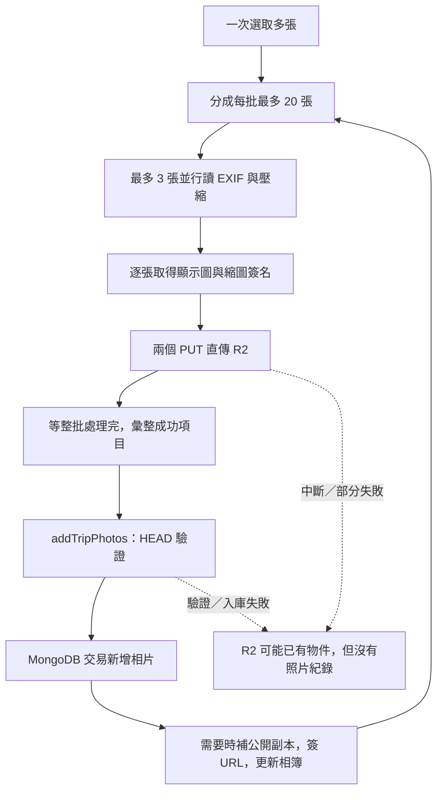
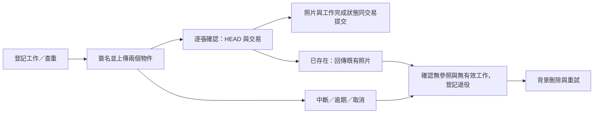

# 相簿上傳體驗、R2 殘留與重複照片研究

研究日期：2026-10-01。原始研究程式碼基準：`c7f4648`。

**結案狀態（2026-10-01）**：本項目依目前約定範圍結案。

| 階段 | 交付與結果 | 文件 |
| --- | --- | --- |
| A–C：上傳改善 | 逐張進度、可靠上傳／重試、新原檔查重；程式與本機測試完成，正式 migration／索引已確認存在 | [實作紀錄](PHOTO_UPLOAD_IMPLEMENTATION.md) |
| D：歷史資料工具 | 只讀盤點、儲存 JPEG hash 回填、同旅程重複報告；工具與隔離 MongoDB 測試完成 | [操作文件](PHOTO_UPLOAD_HISTORY_AUDIT.md) |
| D：正式資料處理 | 140 張照片配對完整；122 張查重無相同 JPEG，18 張近期略過；8 個無參照物件已按指示安全退役並刪除 | [正式測試與清理紀錄](PHOTO_UPLOAD_HISTORY_PRODUCTION_TEST.md) |

**保留限制**：正式 storedHash 回填未執行，歷史 storedHash 未接入新上傳查重；感知比對、歷史重複合併、關頁續傳、精確百分比及其他附件入口未納入本次交付。手機／慢網路上傳、CORS 與 cron 實際排程運行尚未完成端到端驗收。18 張近期照片未涵蓋歷史查重，不能宣稱所有照片都沒有重複。已刪物件的二次清掃由既有背景工作接續，保留退役紀錄。以上限制留作維運或另案，不擴充本次範圍。

以下保留當時的研究證據與提案；文中的「目前／尚未實作」指原始研究時間點，實際進度以以上連結為準。

本次以「旅程相簿一次選多張照片」為主要範圍，檢查前端上傳、伺服器入庫、儲存清理與測試。另列出收據／票券／隨手記的相似問題，避免誤以為它們與相簿共用全部流程。本次只有文件變更，未連線盤點正式環境 R2／MongoDB、未刪除物件，也未進行手機實測；以下區分程式碼事實、推論與建議。

## 先回答兩個問題

**1. 上傳到一半，會不會有檔案留在 R2？會有這個風險。**

目前每張照片先把顯示圖與縮圖送到 R2，再等同批最多 20 張處理完，才一起新增資料庫紀錄。已存進資料庫的前幾批會保留；當批若遇到關頁、斷線、其中一個檔案失敗或入庫失敗，已成功寫入 R2 的物件可能沒有任何相簿紀錄指向它，成為「孤兒物件」。這表示檔案占用儲存空間，但使用者在相簿看不到。

專案已有「刪除相片／附件」與「刪除旅程」的清理工作，但沒有找到「仍存在的旅程，其上傳中斷物件」的自動登記與回收流程。實際已殘留多少物件，必須另外盤點，不能從程式碼推算。

**2. 上傳完能不能知道有沒有重複？目前沒有自動辨識，但可以增加。**

每次上傳都產生新 UUID 路徑，同一張照片重選一次就能變成另一筆照片。現有唯一索引只防止兩筆資料共用同一個物件路徑，沒有比對內容。建議新增「同一旅程內相同檔案的指紋比對」，上傳前跳過已存在的照片，結束後顯示「新增幾張、重複略過幾張、失敗幾張」，並能打開對應的既有照片。

首版辨認「檔案內容完全相同」；裁切、重新匯出、通訊軟體壓縮等「看起來相同」的照片，另以疑似重複功能處理，不自動刪除。

## 現況與程式碼證據

| 入口 | 已確認行為 | 對使用者的影響 |
| --- | --- | --- |
| [PhotoUploadButton.tsx](../../src/components/trips/detail/album/PhotoUploadButton.tsx) `handleFiles` | 只有 `uploading` 布林狀態與轉圈；等整個選取清單結束後才逐一顯示回傳的失敗訊息 | 不知道哪張正在處理、已成功幾張；此元件沒有明確的成功摘要 toast |
| [photoUpload.ts](../../src/lib/photoUpload.ts) `uploadOne` | 先讀 EXIF，再依序壓縮顯示 JPEG 與縮圖 WebP；兩個 PUT 並行 | 一張照片包含兩次物件上傳，任何一個失敗都不能建立正常照片 |
| 同檔 `uploadPhotoFiles`／`mapWithConcurrency` | 最多同時處理 3 張，結果等整批 worker 完成才回傳；缺少每檔例外攔截 | HTTP 失敗可回傳失敗項，但網路 reject 可能讓整批 promise reject |
| 同檔 `uploadPhotoFilesInBatches` | 每批最多 20 張；先完成整批傳檔，再呼叫 `onBatch` 入庫 | 選 12 張時，12 張處理完才入庫；選 45 張時，正常情況為 20、20、5 分批入庫 |
| [相簿頁](<../../src/app/(app)/trips/[id]/album/page.tsx>) `guard` | 入庫錯誤被 catch 後只跳 toast，沒有重新拋出；上傳 callback 使用此 guard | 上傳器把失敗 callback 當成正常完成，增加內部 `uploaded` 數並繼續下一批；目前按鈕沒使用此數字，所以不是已存在的錯誤成功數字 UI |
| [usePhotos.ts](../../src/hooks/queries/usePhotos.ts) `usePhotoMutations` | 入庫成功後 invalidate 相簿查詢，沒有相片的持久上傳佇列 | 相簿按批更新；重新整理後沒有待補存／待重試清單 |
| [upload.actions.ts](../../src/actions/upload.actions.ts) `createPhotoUploadUrls` | 驗成員與申報型別／大小後產生新 key，未建立持久上傳工作 | R2 寫入前沒有可供伺服器追蹤未完成上傳的紀錄 |
| [photo.actions.ts](../../src/actions/photo.actions.ts) `addTripPhotos` | HEAD 驗證兩個物件，再於 MongoDB transaction 新增整批照片；任一 HEAD 不合格就拒絕整批 | DB 交易不能回滾先前已成功的 R2 PUT；拒收後沒有上傳物件清理登記 |
| [Photo.ts](../../src/models/Photo.ts)／[uploads.ts](../../src/lib/uploads.ts) | 只有 `key` 唯一索引；路徑由 `randomUUID()` 產生；沒有內容 hash 或原始檔名欄位 | 無法用目前資料可靠判斷同一張原檔是否曾上傳 |
| [validation.ts](../../src/lib/validation.ts) | 每批 20 張、每旅程 300 張；旅程張數限制在入庫交易內檢查 | 例如已有 295 張，再傳 10 張，可能傳完才因超過上限整批拒收 |

另有兩個影響等待時間／狀態的細節：

- 相簿已開啟公開分享時，`addTripPhotos` 入庫後還會等待 [photoSanitize.ts](../../src/lib/photoSanitize.ts) 檢查並補產公開副本，再回傳 DTO。即使 DB 已寫入，前端仍可能顯示忙碌。
- 空相簿與有照片時的上傳按鈕位於不同分支。第一批入庫後，原按鈕可能被卸載，新的按鈕有全新本機狀態；多批剩餘工作可能失去忙碌顯示。這是依元件結構推論的額外風險，需用空相簿上傳超過 20 張的瀏覽器測試確認。

### 現有資料流



## 中斷與失敗會留下什麼

| 發生位置 | R2／DB 結果 | 目前復原能力 |
| --- | --- | --- |
| 尚在讀 EXIF／壓縮，未 PUT | 該張尚未寫入 R2 | 重選即可 |
| 顯示圖成功、縮圖失敗，或反過來 | 可能留下單一完整物件；不入庫 | 沒有針對這次失敗的清理工作 |
| 幾張兩個 PUT 都成功，但當批還沒傳完就關頁 | 當批已傳完的物件可能留在 R2，DB 尚未新增 | 前幾批若已入庫仍可見，當批沒有持久重試資訊 |
| `fetch` 因離線等原因 reject | worker 的 `Promise.all` 提前 reject；其他 worker 不會因此自動取消，可能仍繼續上傳 | 成功項目未必能回傳入庫；按鈕只有 finally，沒有此層錯誤回報／逐檔回收 |
| R2 完成，但 HEAD／權限／容量／DB 交易拒絕入庫 | 該批沒有新增 DB 紀錄，R2 不隨交易回滾 | guard 吞掉入庫錯誤，後續批次仍可能繼續 |
| DB 已提交，但回應遺失或後續 DTO 簽名失敗 | 照片可能已存在，不一定是孤兒 | 目前缺少「查這次操作到底完成了沒」的協定；重選可能產生重複 |
| 已入庫後使用者刪除照片 | 移除 DB 參照，同交易登記待清物件，立即嘗試並由 cron 重試 | 有既有清理機制，包含顯示圖、縮圖、公開副本 |

「多張中的一部分已上傳」不等於 R2 multipart upload。此專案用每個物件一次 PUT；Cloudflare 的未完成 multipart 清理規則，不能處理「PUT 已完成但 DB 沒引用」的檔案。物件生命週期可按前綴／時間刪檔，但不會替本專案查詢 MongoDB 參照。參考 [R2 Object lifecycles](https://developers.cloudflare.com/r2/buckets/object-lifecycles/)。

上傳 URL 的 120 秒有效期只控制請求授權，不代表物件 120 秒後刪除。關頁或客戶端沒收到成功，也不能據此判定 R2 一定沒收到；需查詢物件與操作狀態。參考 [R2 Presigned URLs](https://developers.cloudflare.com/r2/api/s3/presigned-urls/)。

### 既有清理能沿用，但不能直接宣稱已涵蓋孤兒

- [blobReferences.ts](../../src/lib/blobReferences.ts)：在同一旅程的交易保護下，確認無參照才建立 `blobcleanupjobs`；已退役 key 不能再被新增資料引用。
- [blobCleanup.ts](../../src/lib/blobCleanup.ts)：依持久工作刪檔，失敗可重試，第一次清理後隔 24 小時再掃一次，保留退役紀錄。
- [tripCleanup.ts](../../src/lib/tripCleanup.ts)：處理已刪除旅程的各類前綴，仍存在的旅程不會執行整個前綴刪除。
- [cron route](../../src/app/api/cron/trip-cleanup/route.ts) 與 [vercel.json](../../vercel.json)：程式設定每日執行；本次未確認正式部署排程、secret 或最近執行結果。

缺口是「發現未完成上傳並安全登記清理」，不是再寫一個 `DeleteObjects` 就能解決。

## 建議的上傳操作體驗

把一次選檔視為有逐張結果的工作清單。完成的定義是「伺服器確認照片已存入相簿」，不要把 PUT 成功或傳輸 100% 當成整張完成。

```text
正在處理 12 張照片
已新增 5 張 · 重複略過 2 張 · 失敗 1 張 · 處理中 4 張

IMG_001.jpg   已加入相簿             [查看]
IMG_002.jpg   此相簿已有相同檔案      [查看既有照片]
IMG_003.jpg   上傳中
IMG_004.jpg   正在存入相簿
IMG_005.jpg   連線中斷               [重試]

[只重試失敗項目]  [停止剩餘上傳]
```

建議逐張狀態為：等待 → 檢查重複 → 壓縮 → 上傳 → 存入相簿 → 已完成；另有重複略過、失敗、已取消、確認結果中。回應遺失時先進入「確認結果中」，查明是否已入庫再決定重試。

| 調整 | 建議與取捨 |
| --- | --- |
| 即時進度 | 先做階段與張數，已能回答「目前做到哪裡」。若增加位元組百分比，可用 XHR upload progress；顯示圖與縮圖按實際 bytes 加權，傳完仍須顯示「存入相簿」 |
| 入庫時機 | 建議每張傳完就確認入庫，逐張提供成功結果；先維持最多 3 張處理，不任意提高手機解碼併發 |
| 伺服器負擔 | 每張確認會增加 action／transaction 次數。若量測需要小批合併，必須仍回傳逐張結果，並限制等待時間，不能重新累積到固定 20 張才顯示成功 |
| 相簿刷新 | 可將確認完成的 DTO 合併進快取，節流刷新；避免每新增一張都重抓整個相簿並重新排序造成跳動 |
| 工作狀態位置 | 放在穩定的頁面／旅程層，避免空狀態切換卸載上傳器；若承諾站內換頁仍可繼續，再提升到不隨頁面卸載的層級 |
| 失敗操作 | 逐檔 catch，已成功的不重傳；整批保留結果摘要，失敗清單可展開，不連續彈出大量 toast |
| 取消／離開 | 停止排程、嘗試中止進行中的請求，再向伺服器確認狀態；已完成照片保留。不能靠關頁事件完成必要清理 |
| 容量 | 上傳前顯示剩餘額度；server 仍在交易內檢查。遇到全域容量不足／權限失效應停止新工作，避免繼續傳無法保存的檔案 |

XHR 支援 upload progress、abort、timeout 等事件；跨來源監聽亦涉及 CORS 預檢，需確認 R2 設定與手機瀏覽器行為。參考 [MDN XMLHttpRequest.upload](https://developer.mozilla.org/en-US/docs/Web/API/XMLHttpRequest/upload)。

首版不承諾「關掉瀏覽器還能持續上傳」。伺服器工作紀錄能找回已傳完的物件，但尚未上傳的本機 File 在重開後可能仍要重選。真正的離線／背景／跨重啟續傳是另一個較大範圍。

## 重複照片：方案比較與建議

### 先界定重複

| 判斷方式 | 能回答什麼 | 限制 | 建議 |
| --- | --- | --- | --- |
| 檔名＋檔案大小＋修改時間 | 快速找候選 | 不同照片可能同名同大小；改名也會漏判 | 不作為自動略過依據 |
| 瀏覽器取得的原始 File bytes 做 SHA-256 | 相同內容原檔是否再次選取；改檔名不影響 | 重新編碼、metadata 改動或手機選圖器轉檔，指紋可能不同 | 首版主方案 |
| 實際上傳顯示檔做 SHA-256 | 已儲存的 JPEG bytes 是否相同 | 壓縮版本／平台輸出可能不同；無法取代原檔指紋 | 可選的第二指紋，方便既有照片盤點 |
| 正規化像素／感知雜湊 | 找到畫面相似、但 bytes 不同的圖片 | 連拍可能誤判，裁切旋轉需要另驗證，增加解碼與比對成本 | 後續「疑似重複」列表，人工確認 |
| 直接比對 R2 key／ETag | key 是物件位置；ETag 是儲存端識別資訊 | 目前每次 key 不同；ETag 不是本系統定義的原檔 SHA-256 | 不作為原檔去重方案 |

Web Crypto 可在 HTTPS／Worker 計算 SHA-256，但 `digest()` 不支援串流輸入，需先把該檔案讀入記憶體。應限制計算併發並及時釋放 buffer，不同時讀入整批 50 MB 原檔。參考 [MDN SubtleCrypto.digest](https://developer.mozilla.org/en-US/docs/Web/API/SubtleCrypto/digest)。

### 建議規則

1. 比對範圍為「同一旅程，所有成員已上傳的照片」。同一照片放到不同旅程仍可新增，不做全站查重或跨旅程共用物件。
2. 壓縮前算 `sourceHash`，先處理本次選取內重複，再向伺服器批次查詢既有照片。預查只提供快速回饋，不能取代入庫時的競態保護。
3. 新照片保存 hash 演算法／語意版本與原始檔大小。概念上使用旅程＋hash 的條件式唯一索引，只約束有有效 hash 的新資料，避免舊資料的空值衝突；實作前需驗證 MongoDB 索引遷移。
4. 多裝置或兩位成員同時傳同一檔案，最後由 DB 唯一約束／交易確認唯一結果。落敗的一方回傳 `duplicate` 與既有 `photoId`，其多傳的物件必須進入待清流程，不能只回錯誤。
5. 重複是正常結果，顯示「已在相簿中，已略過」，附既有照片縮圖、上傳者與時間；不要改寫原照片說明、行程日或上傳者。
6. 此首版選擇「同旅程完全相同檔案只保留一份」，不提供強制建立相同副本。若之後要支援刻意保留兩份，必須重新設計唯一性與刪檔參照規則。
7. `sourceHash` 是 client 提交的 UX 比對資料；server 沒拿到壓縮前原檔，無法自行驗證此 hash。既有成員信任模型下可用於重複提醒，但不能拿它作跨旅程讀檔授權、共享 blob 或自動刪除既有照片的依據。已上傳 bytes 的指紋如需可信，須由 server 讀取計算，或驗證 R2 支援的 checksum 機制，不能只 HEAD 大小／型別就宣稱已驗內容。

R2 的 S3 checksum 支援並非與 AWS 所有功能完全相同；實作內容驗證前需逐項確認相容性，不預設某個 checksum header 一定可用。參考 [R2 S3 API compatibility](https://developers.cloudflare.com/r2/api/s3/api/)。

### 舊照片與「上傳後查重」

目前 R2 保存的是壓縮 JPEG 與縮圖，沒有壓縮前原檔。**無法從舊照片重建原檔 `sourceHash`，因此首版不能宣稱可以找出所有歷史重複照片。**

可以分兩層提供能力：

- **新上傳的結果摘要**：每次選檔完成後保留新增／重複／失敗列表，即使上傳前就略過，也能知道哪些原本已存在。
- **既有相簿的重複檢查**：另開盤點工作，對顯示檔建立 `storedHash`，找出儲存 bytes 相同的群組；不同壓縮結果仍會漏判。感知比對只回傳疑似群組與人工比對，不自動刪除。盤點需要讀取既有 R2 內容，應分頁、限速、可重跑，先輸出報告。

新上傳若也計算相同語意的 `storedHash`，可在壓縮後對已回填的舊照片做補充比對；沒命中只能代表「未找到相同儲存檔」，不能代表照片一定全新。舊有重複群組應先盤點再考慮索引，不能直接對未整理的 `storedHash` 加唯一限制。

手機選圖器可能先把 HEIC 轉成 JPEG，再交給網頁；首版 `sourceHash` 指網頁收到的 File，不是手機相簿資產 ID。重新選取同一資產是否產生相同 bytes，需實機驗證，不能只靠目前 accept 欄位註解保證。

## 讓重試與孤兒清理有可靠依據

建議增加「逐張上傳工作」：**先在 DB 登記這次嘗試，再簽發 R2 URL**。保留現有 `photos/<tripId>/<uuid>` 物件結構，每張工作固定配對顯示圖與縮圖。

概念欄位：`uploadId`、`tripId`、`userId`、`sourceHash`、兩個 object keys、預期型別／大小、狀態、簽名最晚有效時間、工作租約／期限、完成的 `photoId`、失敗原因與清理狀態。這是設計草案，尚未定案 schema。



必要契約：

- **確認可重送**：相同 `uploadId` 重送 finalize，若已完成就回傳相同 `photoId`，不新建照片。操作冪等與檔案去重是兩件事，都要有。
- **不確定先查狀態**：PUT 回應遺失時查兩個物件是否已完整存在；DB 回應遺失時查工作是否已提交。不要一遇 timeout 就換 UUID 重傳，或直接刪除可能已入庫的物件。
- **兩個檔案分別追蹤**：其中一個成功時，可以續傳缺少的物件；只有兩個均驗證成功才新增照片。過期簽名可在仍有效的工作中重新簽發，並更新最晚簽名有效時間。
- **隔離逐檔失敗**：每張確認回傳 `saved`／`duplicate`／`retryable`／`rejected` 等可判斷結果。傳輸錯誤、HEAD 暫時不可用與永久拒收要區分；目前 `headObject` 把所有例外都轉為 null，實作時需要改善錯誤分類。
- **避免與清理互撞**：finalize 與工作退役需參與現有同旅程交易保護；清理者先在交易中確認工作過期、無照片參照，登記不可復用 key，再於交易外刪 R2。只做「查一次 DB，稍後 delete」會有競態。
- **考慮仍可寫入的簽名**：工作到期不會撤銷既有 presigned URL。保留超過最後簽名有效期與在途請求緩衝的清理等待，並沿用二次清掃；不要設定工作過期瞬間就永久視為清乾淨。
- **先清物件，再淘汰追蹤紀錄**：不能用 MongoDB TTL 直接刪掉未完成工作，否則再次失去待清 keys。可沿用 `blobcleanupjobs` 的持久重試與退役紀錄，已完成工作的保留期間另定。
- **公開副本分開處理**：將新照片的公開副本產生限定於相關 keys，或交給可重試工作，避免逐張入庫後每次掃整個相簿。公開頁仍只能使用去除敏感 EXIF 的副本，不可為縮短等待改讀私有顯示圖。

初步可用 24 小時作為未完成工作回收寬限的討論起點，實際期限需配合慢網路、可重試期間、簽名展延與排程頻率決定。每日 cron 代表清理不是即時；應記錄待清數量、最老待清時間與失敗重試次數，確認沒有持續堆積。

### 其他清理方案的取捨

| 方案 | 優點 | 不足／建議 |
| --- | --- | --- |
| 前端 catch 後呼叫刪除 | 容易處理畫面仍開著的部分失敗 | 關頁／離線時不可靠，只能輔助；server 必須驗工作歸屬與引用狀態 |
| 持久上傳工作＋背景回收 | 精確知道預期 keys，能查結果、重試與處理競態 | 需新增狀態協定；建議主方案 |
| 定期列 R2 與 DB 比對 | 可找出導入新工作機制前的歷史孤兒 | 列表成本、衍生副本、仍在上傳物件及刪除競態需處理；適合作盤點與補救 |
| 暫存前綴＋R2 lifecycle | 未完成物件可由儲存端過期清理 | 成功後仍需搬移／複製到正式 keys，還有 copy、commit、delete 失敗窗口；會擴大現有 key 規則調整 |
| 對整個 `photos/` 設年齡刪除 | 規則簡單 | 會刪掉仍被相簿引用的正常照片，不採用 |

### 若要確認現在是否已有孤兒

後續先執行只讀盤點，輸出候選 key、大小、最後修改時間、分類與總量，不直接刪除：

1. 分頁列出 `photos/`，比對 DB 的 `key`、`thumbKey`，以及每張有效照片推導出的 `_p.jpg`。公開副本不能被誤判為孤兒。
2. 區分正常物件、缺少配對物件、無相片紀錄、既有待清工作、已刪除旅程的物件；保留最近上傳的緩衝區間。
3. 目前 `listKeys` 只回傳 key，沒有大小／最後修改時間；盤點工具需讀取完整列舉中繼資料，不能直接拿 key 清單就執行刪除。
4. DB／R2 無法做同一個原子快照，候選只能稱為「疑似孤兒」。若之後處理，仍需在旅程交易保護下重新查參照並登記退役，再交由工作清理。

本次沒有執行這份盤點，所以結論是「存在可導致殘留的路徑」，不是「已證實正式環境有幾張殘留」。

## 分階段範圍與驗收

以下皆為建議順序，不代表已開始開發。

| 階段 | 交付內容 | 相對工作量與依賴 |
| --- | --- | --- |
| A：回饋與錯誤傳遞 | 逐張階段／張數、持續顯示的結果列表、逐檔 catch、入庫失敗明確回傳、上傳狀態不隨空相簿切換遺失 | 小到中；改善可見性，單獨完成仍不能解決所有孤兒 |
| B：可靠儲存與重試 | 持久工作、逐張 finalize、冪等、確認結果、有限重試／取消、背景回收；調整公開副本與快取刷新成本 | 中到大；是安全自動重試與去重競態清理的基礎 |
| C：新照片查重 | 原檔 hash、同批／同旅程查重、唯一約束、重複列表與查看既有照片 | 中；與 B 協定共同設計，避免另外造一套重試流程 |
| D：歷史資料整理 | 孤兒只讀盤點、儲存檔 hash 回填、歷史重複報告；有需要再做感知比對 | 另案；涉及資料量與實測，先報告再決定整理方式 |

建議把 A–C 視為完整改善方向；若先交付 A，文件與 UI 應明確保留 B 尚未完成的限制。暫不提供天數估算，需先定案是否要關頁後恢復、歷史查重與精確百分比，並量測手機壓縮／hash 成本。

### 必要驗收情境

| 情境 | 預期結果 |
| --- | --- |
| 空相簿選 1、12、25、45 張 | 每張都可見狀態；已存照片立即可見；空狀態切換不丟失工作，不開出第二個未受控佇列 |
| 其中一張不支援、HTTP 非 2xx、fetch reject | 只影響該張；其他結果仍可保存，總數始終可對帳 |
| 顯示圖成功、縮圖失敗 | 可只補缺少檔案；放棄後進入可重試清理流程 |
| PUT 或 finalize 回應遺失 | 先查結果；重試不增加另一份照片、不誤刪已完成物件 |
| 關頁後再開 | 已完成照片存在；伺服器可查已登記工作；無法恢復的本機檔案明確要求重選 |
| 同批重選／改檔名／同旅程再次上傳相同 bytes | 回傳重複結果並連到既有照片，不新增 DB／R2 永久副本 |
| 兩個成員同時上傳相同檔案 | 最終一筆照片；另一方正常得到重複結果，多餘物件可回收 |
| 不同旅程上傳相同檔案 | 各旅程可正常新增；查重結果不洩漏別團照片 |
| 裁切／改 EXIF／重匯出／HEIC 選圖器轉檔 | 明確呈現精確查重的限制；視覺相似不直接自動略過 |
| 舊照片沒有 sourceHash | 不承諾完整涵蓋；若有 storedHash，僅依相同語意補充判斷 |
| 已有 295 張再選 10 張；或上傳途中他人占滿額度 | 預先提示，server 防超量；拒收項可重試或回收，不繼續無效上傳 |
| 清理與 finalize 同時發生、簽名到期前後仍有 PUT | 只有一致的完成或退役結果；正常照片不被刪，遲到物件最終可清理 |
| 開啟公開分享的大批上傳 | 私有相簿可逐張確認，公開副本可補產；沒有原始 GPS 檔回退到公開頁 |
| R2 刪除失敗、cron 停止後恢復 | 待清工作保留，恢復後可重試；沒有只記 log 就遺失的 keys |
| iPhone Safari／Android、慢網路、大檔 | 有界記憶體與併發；進度不假完成；取消／離開行為可理解 |

目前已有 [photo.actions.test.ts](../../src/__tests__/photo.actions.test.ts) 的物件驗證／上限／刪除等測試，以及 [photoKeys.test.ts](../../src/__tests__/photoKeys.test.ts) 的 key／分批純函式測試；未找到 `uploadPhotoFiles`／`PhotoUploadButton` 完整中斷流程測試。後續實作應補 worker reject、callback 入庫失敗、回應遺失與競態測試，再做真實瀏覽器驗收。本次是靜態研究，沒有執行新功能測試或宣稱上述情境已通過。

## 其他圖片入口

[attachmentUpload.ts](../../src/lib/attachmentUpload.ts) 供收據／票券／隨手記使用，也先 PUT 再由後續表單／action 儲存參照，並以整組 `Promise.all` 彙整；取消表單或網路 reject 同樣有殘留風險。但這些入口與相簿的「兩個物件、EXIF、相簿去重」語意不同。

本研究建議先改善相簿，再抽出適合共用的上傳工作追蹤／回收能力。不要直接套用「同一旅程只准一份」到收據或票券，因為同一附件可能有不同業務引用需求。
